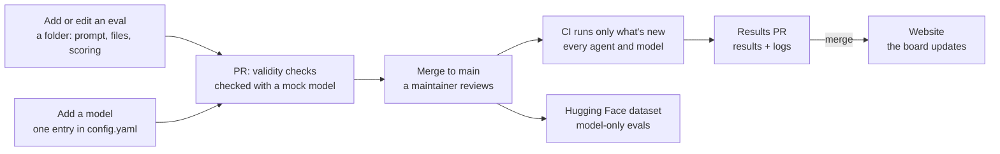

# ETH Evals

<h4 align="center">
  <a href="https://ethevals-site.vercel.app">Website</a> |
  <a href="https://ethevals-site.vercel.app/how-it-works">How it works</a> |
  <a href="docs/add-an-eval.md">Add an eval</a>
</h4>

ETH Evals is an open eval framework built on [Inspect](https://inspect.aisi.org.uk/). It evaluates AI agents and models across four pillars of Ethereum work: concepts, transactions, building, and security.

- **An eval is a folder**: a prompt in YAML, plus Forge tests when it needs a chain.
- **New models on launch day**: adding one is a config change.
- **Every eval proves itself**: its reference answer must pass and an empty answer must fail.
- **The agent can't touch its score**: scoring runs where the agent can't reach.
- **Every run is public**: each result links to its full log.



## Requirements

Before you begin, install these tools:

- [Git](https://git-scm.com/downloads)
- [Python 3.13](https://www.python.org/downloads/) and [uv](https://docs.astral.sh/uv/getting-started/installation/)
- [Docker](https://docs.docker.com/get-started/get-docker/) with Compose, for agent runs
- [Node.js 22 or later](https://nodejs.org/en/download/) and [pnpm 9.14.2](https://pnpm.io/installation), for the website

## Quickstart

1. Clone the repository and install the runner:

```sh
git clone https://github.com/BuidlGuidl/ethevals.git
cd ethevals
uv sync --frozen
```

2. Ask Opus 5.5 a quiz question, with no tools and no Docker:

```sh
export ANTHROPIC_API_KEY=<your key>
uv run ethevals run --evals evals/concepts/agent-registries --models opus-5.5 --modes vanilla --epochs 1 --budget 50 --output results/quickstart --rows results/quickstart/rows.jsonl
```

`--budget` is a ceiling in USD. This run costs under a cent. `--output` and `--rows` keep your run apart from the published results.

3. Start Docker and give the same question to Claude Code, which gets a shell and the internet:

```sh
uv run ethevals run --evals evals/concepts/agent-registries --agents claude-code-opus-5.5 --modes internet --epochs 1 --budget 50 --output results/quickstart --rows results/quickstart/rows.jsonl
```

4. Read the logs in Inspect's viewer, at the URL it prints:

```sh
uv run inspect view --log-dir results/quickstart/logs
```

5. Start the website in a second terminal, then open http://localhost:3000:

```sh
cd site
pnpm install --frozen-lockfile
pnpm run dev
```

**What's next**

- Write your own eval with the [add-an-eval guide](docs/add-an-eval.md).
- Add a model or an agent in [`config.yaml`](inspect-runner/ethevals/config.yaml).
- Look up scoring, limits, budgets, and CI in the [runner reference](inspect-runner/README.md).
- Build and check the website with the [site guide](site/README.md).
- Look up words like mode, harness, and epoch in the [glossary](CONTEXT.md).
