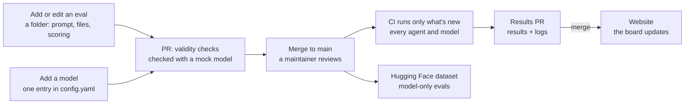

# ETH Evals

<h4 align="center">
  <a href="https://ethevals-site.vercel.app">Website</a> |
  <a href="https://ethevals-site.vercel.app/how-it-works">How it works</a> |
  <a href="docs/add-an-eval.md">Add an eval</a>
</h4>

ETH Evals is an open eval framework built on [Inspect](https://inspect.aisi.org.uk/). It evaluates AI agents and models across four pillars of Ethereum work: concepts, transactions, building, and security.

- **An eval is a folder**: a prompt in YAML, plus Forge tests when it needs a chain.
- **New models on launch day**: adding one is a config change.
- **Every eval proves itself**: its reference answer must pass and an empty answer must fail.
- **The agent can't touch its score**: scoring runs where the agent can't reach.
- **Every run is public**: each result links to its full log.


```mermaid
flowchart LR
	eval["Add or edit an eval<br/>a folder: prompt, files, scoring"] --> pr["PR: validity checks<br/>checked with a mock model"]
	model["Add a model<br/>one entry in config.yaml"] --> pr
	pr --> merge["Merge to main<br/>a maintainer reviews"]
	merge --> ci["CI runs only what's new<br/>every agent and model"]
	ci --> results["Results PR<br/>results + logs"]
	results -- merge --> site["Website<br/>the board updates"]
	merge --> hf["Hugging Face dataset<br/>model-only evals"]
```

## Requirements

Before you begin, install these tools:

- [Git](https://git-scm.com/downloads)
- [Python 3.13](https://www.python.org/downloads/) and [uv](https://docs.astral.sh/uv/getting-started/installation/)
- [Docker](https://docs.docker.com/get-started/get-docker/) with Compose, for agent runs
- [Node.js 22 or later](https://nodejs.org/en/download/) and [pnpm 9.14.2](https://pnpm.io/installation), for the website

## Quickstart

1. Clone the repository and install the runner:

```sh
git clone https://github.com/BuidlGuidl/ethevals.git
cd ethevals
uv sync --frozen
```

2. Start Docker and check the Harbor tasks without a model or provider key:

```sh
unset OPENROUTER_API_KEY ANTHROPIC_API_KEY OPENAI_API_KEY ANTHROPIC_AUTH_TOKEN EXA_API_KEY
uv run ethevals free-check --output results/quickstart
```

Each task's oracle run must pass, and its nop run must fail.
Use a fresh output directory each time.
Read [the Harbor guide](docs/harbor.md) for task inputs and check records.

3. Check the tasks that still use Inspect during the move:

```sh
uv run ethevals check --output results/inspect-check
```

4. Read their trajectories in Inspect's viewer, at the URL it prints:

```sh
uv run inspect view --log-dir results/inspect-check/reference/logs
```

5. Start the website in a second terminal, then open http://localhost:3000:

```sh
cd site
pnpm install --frozen-lockfile
pnpm run dev
```

**What's next**

- Write your own eval with the [add-an-eval guide](docs/add-an-eval.md).
- Add a model or an agent in [`config.yaml`](inspect-runner/ethevals/config.yaml).
- Look up scoring, limits, budgets, and CI in the [runner reference](inspect-runner/README.md).
- Build and check the website with the [site guide](site/README.md).
- Look up words like mode, harness, and epoch in the [glossary](CONTEXT.md).
