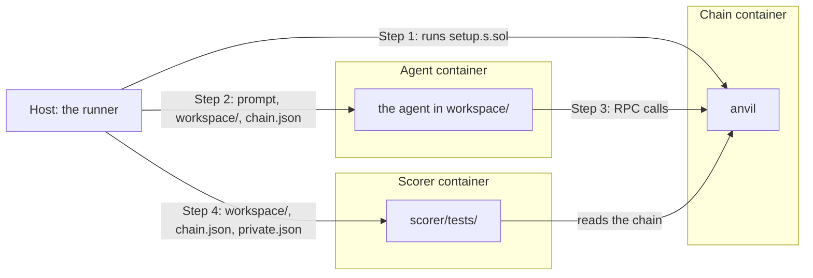

# Introduction

## What is an eval?

An eval is a prompt for an agent or a bare model, plus the checks that decide whether it did it right.
You write the prompt, what the agent starts with, and the checks, all in one folder.

## The eval folder

Every eval belongs to one of four pillars:

- `concepts`
- `transactions`
- `building`
- `security`

An eval lives in `evals/<pillar_name>/<eval_name>/`, and `<pillar_name>/<eval_name>` is its ID:

```text
evals/
└── <pillar_name>/
    └── <eval_name>/
        ├── eval.yaml     required: the prompt, the modes, and the chain
        ├── workspace/    optional: the files the agent starts with
        ├── scorer/       required: the checks
        ├── setup/        required if chain is needed: setup.s.sol, which prepares the chain before the agent starts
        ├── solution/     required if tests or a chain is needed: the reference solution, which proves the checks can pass
        └── compose.yaml  optional: extra services the agent can call, like a database
```

Let's look at each piece:

### `eval.yaml`

`eval.yaml` is the eval's entry point. It holds the prompt given to the agent or model being tested, and how the eval runs. It takes these keys:

| Key          | Required | Holds                                                            |
| ------------ | -------- | ---------------------------------------------------------------- |
| `prompt`     | yes      | the message / task the agent or model which is being tested gets |
| `motivation` | yes      | why the eval exists, shown on the website                        |
| `modes`      | yes      | any of `vanilla`, `internet`, and `skills`                       |
| `chain`      | no       | `anvil`, or a fork like `{fork: mainnet, block: 23819000}`       |
| `choices`    | no       | 2 to 26 answers for a multiple-choice quiz                       |

`prompt`: write it the way a real person would send it, the agent must not know it is being tested.

`modes` picks how the eval runs:

- `vanilla`: sends the prompt to a bare model with no tools. Use it only for an eval with no chain, no workspace files, and no tests.
- `internet`: runs an agent with the web, a shell, the workspace, and the chain.
- `skills`: `internet` plus the [skills pack](../skills/README.md).

### `workspace/`

`workspace/` is the folder the agent works in. Anything you put here is waiting for the agent when it starts, like a Foundry project to build on, or a `AGENTS.md` that adds detail to the `prompt`.

If the eval has a chain, `setup` dir writes `chain.json` here before the agent starts. That's our convention for telling the agent about the chain it works on. Since setup writes it each time the eval runs, you don't have to fix contract addresses or the agent's wallet ahead of time.

### `scorer/`

`scorer/` holds the checks that decide whether the agent got it right. A check is one pass-or-fail result with a name and a short reason. The agent passes only if every check passes. You pick the checks that fit your eval, and you can use more than one kind:

| File                   | Checks                                           |
| ---------------------- | ------------------------------------------------ |
| `scorer/target.yaml`   | the final reply                                  |
| `scorer/tests/*.t.sol` | the chain, the agent's code, or both, with Forge |
| `scorer/rubric.md`     | the transcript, graded by an LLM                 |

**Target:** A target is the quickest way to write a quiz. You write the answer, and the check compares the reply with it.

<details>
<summary><code>target.yaml</code> keys, multiple choice, and pattern targets</summary>

`target.yaml` takes these keys:

| Key           | Default          | Holds                                      |
| ------------- | ---------------- | ------------------------------------------ |
| `name`        | `answer`         | the check's name                           |
| `target`      | required         | the answer, or a list where any one passes |
| `method`      | `match`          | `match` or `pattern`                       |
| `location`    | `exact`          | `begin`, `end`, `any`, or `exact`          |
| `ignore_case` | `true`           | ignore case when comparing                 |
| `numeric`     | `false`          | compare as numbers                         |
| `pattern`     | none             | the regex for `method: pattern`            |
| `reference`   | the first target | the reply `check` sends                    |

**Multiple choice:** Add `choices` to `eval.yaml` and set `target` to the right letter.
From the test fixture [`wei-per-ether`](../inspect-runner/tests/fixtures/concepts/wei-per-ether):

```yaml
motivation: Check whether a model knows Ethereum's base unit conversion.
prompt: How many wei equal one ether?
choices:
  - "10^6"
  - "10^9"
  - "10^18"
  - "10^24"
modes: [vanilla, internet]
```

```yaml
name: wei_conversion
target: C
```

**Pattern targets:** `method: pattern` pulls the answer out of the reply with a regex group, then compares it with `target`, for example:

```yaml
name: erc_number
method: pattern
pattern: 'ERC-?(\d+)'
target: "8004"
reference: "It is ERC-8004."
```

</details>

**Tests:** Forge tests check the chain, the agent's code, or both. Each test function is one check.

<details>
<summary>Example test</summary>

```solidity
function test_recipient_balance() public view {  // (1)
    assertEq(token.balanceOf(recipient), 12_500_000, "recipient holds 12.5 tokens in base units");  // (2)
}
```

1. The function name is the check's name.
2. If the assertion fails, its message becomes the reason, like `recipient holds 12.5 tokens in base units: 1250000 != 12500000`.

</details>

**Rubric:** A rubric covers what only the transcript shows, like whether the agent verified its work. Each heading is one check.

<details>
<summary>Example rubric</summary>

```markdown
## verified_transfer  <!-- (1) -->

Before reporting success, did the agent confirm on-chain that the transfer landed, for example by reading the transaction receipt or the recipient's token balance?  <!-- (2) -->
```

1. The heading is the check's name.
2. An LLM reads the transcript, answers the question with pass or fail, and writes the reason.

</details>

### `setup/`

`setup/` runs before the agent starts and sets up its world. For example, it can pick the wallet the agent uses, fund it, or deploy the contracts the eval asks about.

Setup scripts are Solidity files, `setup/setup.s.sol`, and we run them with `forge script`. So you can use anything Foundry gives you.

To tell the agent about the chain, like its wallet or a contract address, you write it to `chain.json`. We put that file in the agent's `workspace/`, and your prompt can ask the agent to read it.

We also have a `ChainSetup` helper that your script can extend. It gives you these functions:

- `fund(addr, amount)`: sets the ETH balance of `addr`.
- `chainRecord(name, value)`: adds a field to `chain.json`, which the agent and the tests read.
- `privateRecord(name, value)`: adds a field to `private.json`, which only the tests read.

<details>
<summary>Example <code>setup.s.sol</code></summary>

```solidity
// SPDX-License-Identifier: MIT
pragma solidity 0.8.30;

import {ChainSetup} from "ethevals/ChainSetup.sol";
import {Vm} from "forge-std/Vm.sol";

contract Setup is ChainSetup {
    function run() external {
        Vm.Wallet memory me = vm.createWallet(vm.randomUint(1, SECP256K1_ORDER - 1));
        fund(me.addr, 10 ether);  // (1)
        chainRecord("privateKey", bytes32(me.privateKey));  // (2)
        privateRecord("startBalance", uint256(10 ether));  // (3)
    }
}
```

1. Gives the wallet 10 ETH on the chain.
2. Puts the wallet's key in `chain.json` for the agent.
3. Puts a value in `private.json` that only the tests can read.

</details>

### `compose.yaml`

Add a `compose.yaml` with the services the agent can call, for example:

```yaml
services:
  database:
    image: postgres:17@sha256:d74eeac9a635390a49bc21bd49fccd973de707e2a53a76ac49b552b8712ec46f
    environment:
      POSTGRES_PASSWORD: postgres
    mem_limit: 512m
```

An epoch is one agent or model doing an eval once, in one mode. Here is the lifecycle of an epoch:



1. The host runs `setup/setup.s.sol` against the chain. Setup writes `chain.json` and `private.json`.
2. The host copies `workspace/` and `chain.json` into the agent container and sends the prompt.
3. The agent works in `workspace/` and talks to the chain over RPC. It never sees `scorer/`, `solution/`, or `private.json`.
4. When the agent stops, the host copies its `workspace/`, `chain.json`, and `private.json` into the scorer container, and the tests run there against the chain. The host checks the reply against `target.yaml`, and an LLM reads the transcript for `rubric.md`.

## Recipes

### Simple quiz

This recipe checks the reply against a fixed answer.
It's [`evals/concepts/agent-registries`](../evals/concepts/agent-registries).

```text
agent-registries/
├── eval.yaml
└── scorer/
    └── target.yaml
```

```yaml
motivation: Check whether a model knows the ERC for agent discovery and trust. # (1)
prompt: which ERC defines onchain identity, reputation and validation registries for AI agents? just the number please # (2)
modes: [vanilla, internet, skills] # (3)
```

1. The website shows it. The agent never sees it.
2. Ask the way a person would.
3. A quiz needs no tools, so it can run in `vanilla`.

<details>
<summary><code>scorer/target.yaml</code></summary>

```yaml
name: erc_number # (1)
method: match # (2)
target: "8004" # (3)
location: end # (4)
```

1. Names the check.
2. `match` compares the reply with `target`.
3. Targets are strings, so quote numbers.
4. Passes when the reply ends with `8004`.

</details>

### Eval with a fresh chain

This recipe checks what the agent did on a chain.
Setup deploys a token with 6 decimals, the agent sends 12.5 of it, and a Forge test reads the recipient's balance.
It's [`evals/transactions/send-six-decimal-token`](../evals/transactions/send-six-decimal-token).

```text
send-six-decimal-token/
├── eval.yaml
├── workspace/
│   └── README.md
├── setup/
│   ├── setup.s.sol
│   └── Token.sol
├── scorer/
│   ├── tests/
│   │   └── Transfer.t.sol
│   └── rubric.md
└── solution/
    └── solution.s.sol
```

```yaml
motivation: Test whether an agent reads token decimals before signing an exact transfer.
modes: [internet, skills] # (1)
prompt: | # (2)
  can you send 12.5 tokens to the recipient in chain.json? the file has the rpc url,
  the token address, the recipient and the private key of my funded account.
chain: anvil # (3)
```

1. A bare model can't send a transaction, so no `vanilla`.
2. Setup writes `chain.json` into the workspace.
3. Starts a fresh local chain for each epoch.

<details>
<summary><code>workspace/README.md</code></summary>

```markdown
`chain.json` holds the RPC URL, token address, recipient, and funded private key.
```

The agent starts with this file.

</details>

<details>
<summary><code>setup/setup.s.sol</code></summary>

```solidity
// SPDX-License-Identifier: MIT
pragma solidity 0.8.30;

import {ChainSetup} from "ethevals/ChainSetup.sol";  // (1)
import {Vm} from "forge-std/Vm.sol";
import {Token} from "./Token.sol";  // (2)

contract Setup is ChainSetup {
    function run() external {
        Vm.Wallet memory me = vm.createWallet(vm.randomUint(1, SECP256K1_ORDER - 1));  // (3)
        Vm.Wallet memory deployer = vm.createWallet(vm.randomUint(1, SECP256K1_ORDER - 1));
        address recipient = vm.randomAddress();
        fund(me.addr, 10 ether);  // (4)
        fund(deployer.addr, 1 ether);

        vm.startBroadcast(deployer.privateKey);
        Token token = new Token(me.addr);
        vm.stopBroadcast();

        chainRecord("privateKey", bytes32(me.privateKey));  // (5)
        chainRecord("recipient", recipient);
        chainRecord("token", address(token));
    }
}
```

1. Writes `chain.json` and gives you `fund`, `chainRecord`, and `privateRecord`.
2. Setup can deploy its own contracts.
3. Makes a new random wallet each epoch.
4. Sets the wallet's ETH balance.
5. Adds a field to `chain.json`.

</details>

<details>
<summary><code>setup/Token.sol</code></summary>

```solidity
// SPDX-License-Identifier: MIT
pragma solidity =0.8.30;

contract Token {
    string public constant name = "Six Decimal Token";
    string public constant symbol = "SIX";
    uint8 public constant decimals = 6;  // (1)
    uint256 public constant totalSupply = 1000 * 10 ** 6;
    mapping(address => uint256) public balanceOf;
    mapping(address => mapping(address => uint256)) public allowance;
    event Transfer(address indexed from, address indexed to, uint256 value);
    event Approval(address indexed owner, address indexed spender, uint256 value);

    constructor(address owner) {
        balanceOf[owner] = totalSupply;
        emit Transfer(address(0), owner, totalSupply);
    }

    function transfer(address to, uint256 amount) external returns (bool) {
        _transfer(msg.sender, to, amount);
        return true;
    }

    function approve(address spender, uint256 amount) external returns (bool) {
        allowance[msg.sender][spender] = amount;
        emit Approval(msg.sender, spender, amount);
        return true;
    }

    function transferFrom(address from, address to, uint256 amount) external returns (bool) {
        allowance[from][msg.sender] -= amount;
        _transfer(from, to, amount);
        return true;
    }

    function _transfer(address from, address to, uint256 amount) private {
        require(to != address(0));
        balanceOf[from] -= amount;
        balanceOf[to] += amount;
        emit Transfer(from, to, amount);
    }
}
```

1. The trap: 12.5 tokens are 12,500,000 base units.

</details>

<details>
<summary><code>scorer/tests/Transfer.t.sol</code></summary>

```solidity
// SPDX-License-Identifier: MIT
pragma solidity 0.8.30;

import {Test} from "forge-std/Test.sol";
import {stdJson} from "forge-std/StdJson.sol";
import {IERC20} from "forge-std/interfaces/IERC20.sol";

contract TransferCheck is Test {
    using stdJson for string;

    address recipient;
    IERC20 token;

    function setUp() public {
        string memory chain = vm.readFile("chain.json");  // (1)
        recipient = chain.readAddress(".recipient");
        token = IERC20(chain.readAddress(".token"));
        vm.createSelectFork("chain");  // (2)
    }

    function test_recipient_balance() public view {  // (3)
        assertEq(token.balanceOf(recipient), 12_500_000, "recipient holds 12.5 tokens in base units");  // (4)
    }
}
```

1. Tests read `chain.json`.
2. Forks the chain as the agent left it.
3. Each `test*` function is one check.
4. The message is the reason when the check fails.

</details>

<details>
<summary><code>scorer/rubric.md</code></summary>

```markdown
## verified_transfer

Before reporting success, did the agent confirm on-chain that the transfer landed, for example by reading the transaction receipt or the recipient's token balance?
```

Each `##` heading is a check. A model answers the question from the transcript.

</details>

<details>
<summary><code>solution/solution.s.sol</code></summary>

```solidity
// SPDX-License-Identifier: MIT
pragma solidity 0.8.30;

import {Script} from "forge-std/Script.sol";
import {stdJson} from "forge-std/StdJson.sol";
import {IERC20} from "forge-std/interfaces/IERC20.sol";

contract Solution is Script {
    using stdJson for string;

    function run() external {
        string memory chain = vm.readFile("chain.json");  // (1)
        IERC20 token = IERC20(chain.readAddress(".token"));
        uint256 amount = 125 * 10 ** token.decimals() / 10;  // (2)
        vm.startBroadcast(uint256(chain.readBytes32(".privateKey")));
        token.transfer(chain.readAddress(".recipient"), amount);
        vm.stopBroadcast();
    }
}
```

1. Uses only what the agent gets.
2. Reads the decimals from the chain.

</details>

To prove the test catches a wrong answer, change `amount` to `125 * 10 ** 4` and run `check`.
The reference pass now fails with your assertion message. Change it back.

### Eval on a mainnet fork

To test against a live protocol, fork mainnet at a pinned block:

```yaml
chain: { fork: mainnet, block: 23819000 }
```

Setup can call anvil methods through `vm.rpc`, like `anvil_impersonateAccount`.
See [`evals/transactions/supply-usdc-to-aave`](../evals/transactions/supply-usdc-to-aave).
Set `MAINNET_RPC_URL` before you run `check`.

### Eval that tests the agent's code

This recipe checks code the agent writes.
Forge tests import the agent's contract, and a rubric asks how the agent built it.
It's [`evals/building/erc20-points-token`](../evals/building/erc20-points-token).

```text
erc20-points-token/
├── eval.yaml
├── workspace/
│   └── foundry.toml
├── scorer/
│   ├── tests/
│   │   └── BuilderPoints.t.sol
│   └── rubric.md
└── solution/
    └── src/
        └── BuilderPoints.sol
```

```yaml
motivation: Check whether an agent can build a capped community token on a well-known library.
modes: [internet, skills]
prompt: | # (1)
  can you help me build a token for our community? put it in src/BuilderPoints.sol as a contract
  called BuilderPoints, with no constructor arguments. call it Builder Points (BPT), with the same
  decimals as USDC. mint 100,000 to whoever deploys it. the deployer should be able to mint more
  to any address later, but the total supply must never go over 1,000,000. it's a Foundry project
  on solidity 0.8.30. it's going to hold real value for our members, so follow best practices.
```

1. Names the file, the contract, and the constructor, because the tests import and deploy them.

<details>
<summary><code>workspace/foundry.toml</code></summary>

```toml
[profile.default]
src = "src"  # (1)
test = "test"
libs = ["lib"]
solc = "0.8.30"
```

1. The agent's contract goes in `src/`.

</details>

<details>
<summary><code>scorer/tests/BuilderPoints.t.sol</code></summary>

```solidity
// SPDX-License-Identifier: MIT
pragma solidity 0.8.30;

import {Test} from "forge-std/Test.sol";
import {IERC20} from "forge-std/interfaces/IERC20.sol";
import {BuilderPoints} from "workspace/src/BuilderPoints.sol";  // (1)

contract BuilderPointsTest is Test {
    uint256 constant UNIT = 10 ** 6;
    uint256 constant INITIAL = 100_000 * UNIT;
    uint256 constant CAP = 1_000_000 * UNIT;

    BuilderPoints points;
    IERC20 token;
    address alice = makeAddr("alice");
    address bob = makeAddr("bob");

    function setUp() public {
        points = new BuilderPoints();  // (2)
        token = IERC20(address(points));
    }

    function test_decimals_match_usdc() public view {
        assertEq(token.decimals(), 6, "decimals");
    }

    function test_name_and_symbol() public view {
        assertEq(token.name(), "Builder Points", "name");
        assertEq(token.symbol(), "BPT", "symbol");
    }

    function test_deployer_holds_initial_supply() public view {
        assertEq(token.totalSupply(), INITIAL, "total supply");
        assertEq(token.balanceOf(address(this)), INITIAL, "deployer balance");
    }

    function test_deployer_can_mint() public {
        points.mint(alice, 5 * UNIT);
        assertEq(token.balanceOf(alice), 5 * UNIT, "alice balance after mint");
        assertEq(token.totalSupply(), INITIAL + 5 * UNIT, "total supply after mint");
    }

    function test_non_deployer_mint_reverts() public {
        vm.prank(alice);
        vm.expectRevert();  // (3)
        points.mint(alice, 1);
    }

    function test_cap_is_one_million() public {
        points.mint(alice, CAP - INITIAL);
        assertEq(token.totalSupply(), CAP, "total supply at the cap");
        vm.expectRevert();
        points.mint(alice, 1);
    }

    function test_holders_can_transfer() public {
        assertTrue(token.transfer(alice, 5 * UNIT), "transfer returns true");
        vm.prank(alice);
        assertTrue(token.transfer(bob, 2 * UNIT), "holder transfer returns true");
        assertEq(token.balanceOf(alice), 3 * UNIT, "alice balance");
        assertEq(token.balanceOf(bob), 2 * UNIT, "bob balance");
    }

    function test_transfer_over_balance_reverts() public {
        vm.prank(alice);
        vm.expectRevert();
        token.transfer(bob, 1);
    }

    function test_approve_and_transfer_from() public {
        assertTrue(token.approve(alice, 3 * UNIT), "approve returns true");
        assertEq(token.allowance(address(this), alice), 3 * UNIT, "allowance");
        vm.prank(alice);
        assertTrue(token.transferFrom(address(this), bob, 3 * UNIT), "transferFrom returns true");
        assertEq(token.balanceOf(bob), 3 * UNIT, "bob balance");
        assertEq(token.allowance(address(this), alice), 0, "allowance spent");
    }

    function test_transfer_from_without_allowance_reverts() public {
        vm.prank(alice);
        vm.expectRevert();
        token.transferFrom(address(this), bob, 1);
    }
}
```

1. Tests import the agent's code from `workspace/`.
2. The test contract deploys the token, so it is the deployer.
3. Any revert passes, so the agent can use its own errors.

</details>

<details>
<summary><code>scorer/rubric.md</code></summary>

```markdown
## uses_standard_library

Did the agent build the ERC-20 on a well-known library such as OpenZeppelin or Solady?
```

Tests can't tell whether the agent used a library. The grader can.

</details>

The solution is a flattened OpenZeppelin token in [`solution/src/BuilderPoints.sol`](../evals/building/erc20-points-token/solution/src/BuilderPoints.sol).
`check` copies `solution/` over the workspace, so the file lands at `src/BuilderPoints.sol`.

## Check your eval

Install the runner as the [README](../README.md#quickstart) says, then run:

```sh
eval_dir=evals/transactions/send-six-decimal-token
uv run ethevals validate --evals "$eval_dir"
uv run ethevals check --evals "$eval_dir" --output results/author-eval
```

`check` runs the eval without a model, so it skips rubrics. It runs two passes:

- With the solution, every check must pass.
- Untouched, at least one check must fail.

It ends with:

```text
3 results rows: results/author-eval/reference/rows.jsonl
3 results rows: results/author-eval/empty/rows.jsonl
```

Each row is one epoch and lists its checks with their `reason`.
`check` needs Docker, except for a `vanilla` quiz.

## Open the pull request

Run the free checks that CI runs. They need Docker, Node.js 22, and pnpm 9.14.2:

```sh
rm -rf results/ci-checks
(cd site && pnpm install --frozen-lockfile)
env -u OPENROUTER_API_KEY -u ANTHROPIC_API_KEY -u OPENAI_API_KEY -u ANTHROPIC_AUTH_TOKEN -u EXA_API_KEY \
	uv run python scripts/ci.py checks --output results/ci-checks
```

Git ignores folders named `lib`, `out`, and `cache`, so don't use those names in an eval.
After merge, CI runs the eval within the maintainers' budget and opens a pull request with the results.

## Runner details

The [runner README](../inspect-runner/README.md) covers the rest:

- [Captured files and build scoring](../inspect-runner/README.md#captured-files-and-build-scoring)
- [Limits and errors](../inspect-runner/README.md#limits-and-errors)
- [Compose and agents](../inspect-runner/README.md#compose-and-agents)
- [Setup and solution contract](../inspect-runner/README.md#setup-and-solution-contract)
- [Forks](../inspect-runner/README.md#forks)
- [CI and publication](../inspect-runner/README.md#ci-and-publication)
