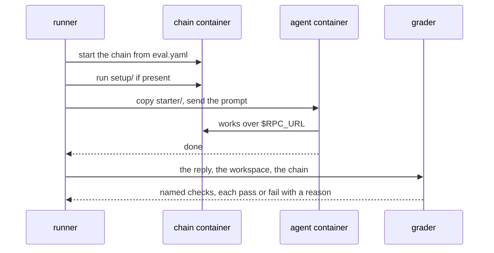
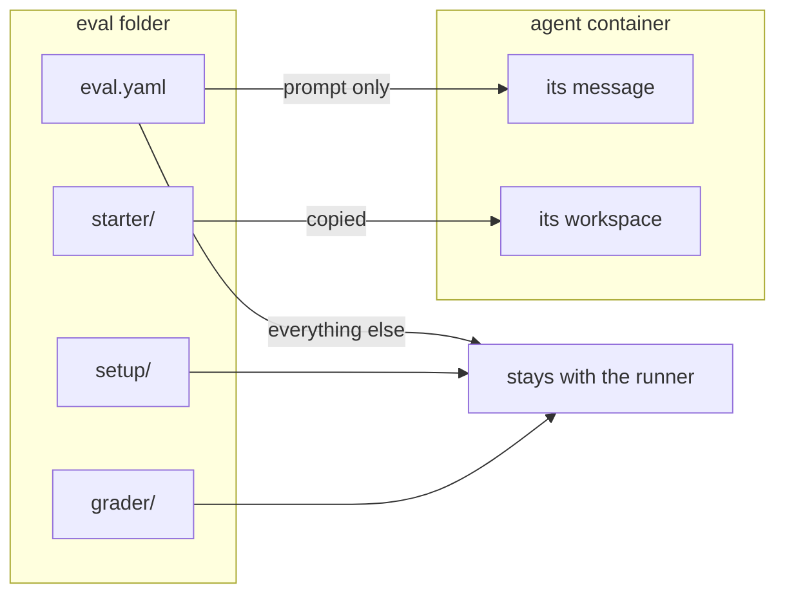
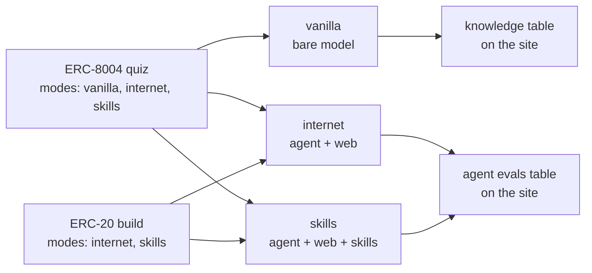
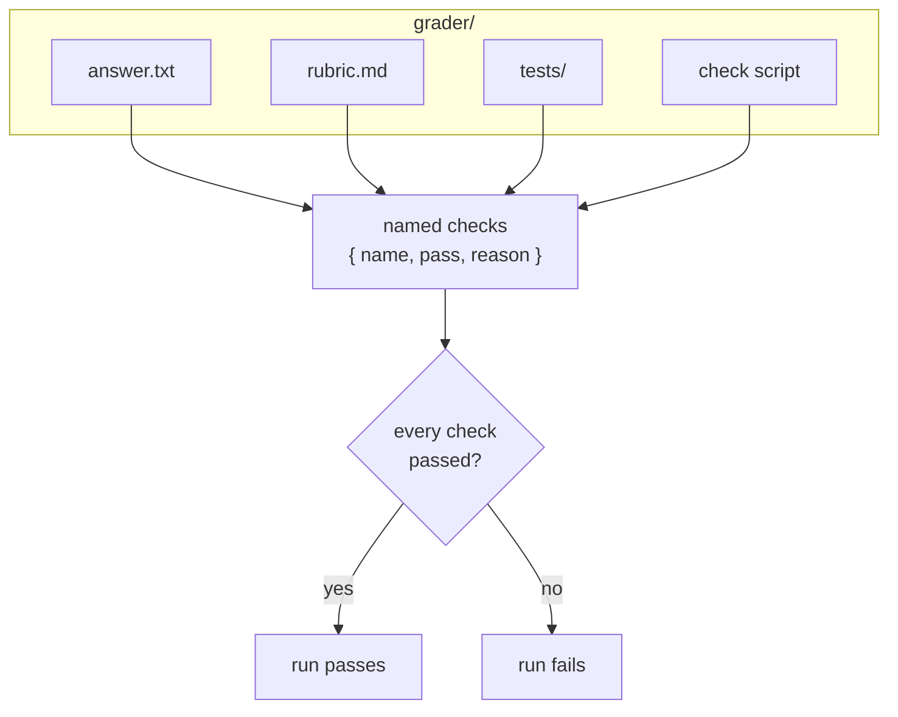
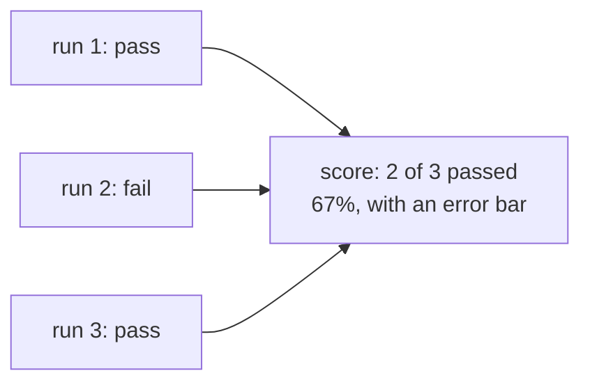

# Eval spec (draft)

An eval is a question or a job for an agent, plus a way to check the result. Each eval lives in its own folder. The runner reads the folder, starts the agent and, if the eval needs one, a chain, each in its own container. It sends the prompt, and when the agent is done, a grader decides whether the run passed.

This page covers the small core that every eval shares. What we will only learn by writing and running evals is listed at the end, as open questions or as parked items. The terms are defined in [`CONTEXT.md`](../CONTEXT.md), and the reasons behind the shape are in [`docs/adr/`](adr/).

## An eval is one folder

Evals are grouped by pillar: `concepts`, `transactions`, `building`, or `security`.

```text
evals/
└── <pillar>/
    └── <eval-name>/
        ├── eval.yaml     # metadata and the prompt
        ├── starter/      # optional: files copied into the agent's workspace
        ├── setup/        # optional: a script that prepares the chain
        └── grader/       # everything that decides pass or fail
```

## One run, start to finish

A run is one agent attempting one eval in one mode. The chain steps happen only when `eval.yaml` asks for a chain.



In the `vanilla` mode there are no containers. The runner sends the prompt straight to the model, and the grader checks the reply.

## eval.yaml

| Field | Required | What it holds |
|---|---|---|
| `type` | yes | What the agent does: `quiz`, `scenario`, `build`, or `act`. |
| `modes` | yes | The modes this eval runs in: any of `vanilla`, `internet`, and `skills`. The mode names are still in discussion. |
| `motivation` | yes | One line on why this eval exists. |
| `prompt` | yes | The message the agent receives. |
| `chain` | no | The chain this eval needs. Leave it out for no chain. |

<details>
<summary>

#### Example: a quiz

</summary>

A quiz is `eval.yaml` plus its answer in `grader/`.

```text
evals/concepts/erc-8004-number/
├── eval.yaml
└── grader/
    └── answer.txt
```

`eval.yaml`:

```yaml
type: quiz
modes: [vanilla, internet, skills]
motivation: ERC-8004 is recent, so a model without the web or skills may not know it.
prompt: |
  which ERC gives AI agents onchain identity, reputation and validation registries?
  reply with just the number, nothing else.
```

`grader/answer.txt`:

```text
8004
```

</details>

<details>
<summary>

#### Example: a build

</summary>

A build keeps its details in `starter/`. It can use more than one grader: tests for what code can check, and a rubric for what only a reader can judge.

```text
evals/building/erc20-points-token/
├── eval.yaml
├── starter/
│   └── SPEC.md
└── grader/
    ├── rubric.md
    └── tests/
        └── PointsToken.t.sol
```

`eval.yaml`:

```yaml
type: build
modes: [internet, skills]
motivation: The most common thing people ask an agent to build. Checks it builds on OpenZeppelin instead of writing its own token code.
prompt: |
  make an ERC-20 for our community points. details are in SPEC.md
```

`starter/SPEC.md`:

```md
- Foundry project, contract `PointsToken` in `src/PointsToken.sol`
- name "Buidl Points", symbol "BPT", 18 decimals
- 1,000,000 BPT minted to the deployer
- the owner can mint more with `mint(address to, uint256 amount)`, nobody else can
```

`grader/tests/PointsToken.t.sol` checks what code can check. Each test is one check:

- The name is "Buidl Points", the symbol is "BPT", and there are 18 decimals.
- The deployer holds 1,000,000 BPT.
- The owner can mint.
- A mint from any other address reverts.

`grader/rubric.md` checks what a test can't see:

```md
- The token imports `ERC20` and `Ownable` from OpenZeppelin. It doesn't copy them or write its own transfer logic.
- The contract adds nothing that SPEC.md doesn't ask for.
```

</details>

## starter/

`starter/` holds the files the agent starts with: a spec, a half-built repo, or a contract to review. The runner copies it into the agent's workspace before the run. Details that would make the prompt long go here, so the prompt can point at them, as the build example does with `SPEC.md`.

## What gets copied into the agent container

Only two things from the eval folder reach the agent. The prompt becomes its message, and `starter/` becomes its workspace. Everything else stays with the runner. If the eval asks for a chain, the agent finds it at `$RPC_URL`.



## Modes decide who runs and where results show

| Mode | Who runs | What it can reach |
|---|---|---|
| `vanilla` | the bare model, no harness | nothing: one question, one reply |
| `internet` | an agent | the web, a shell, its workspace, and the eval's chain |
| `skills` | an agent | everything in `internet`, plus Ethereum skills |

Only quizzes can list `vanilla`, because a bare model has no agent loop and can only answer. The site shows `vanilla` results in their own table, because they measure what a model knows, not what an agent can do.



A quiz that lists all three modes shows three steps: what the model remembers, what an agent finds by searching, and what skills add.

## Graders return named checks

`grader/` holds everything that decides whether a run passed. A check is one thing a grader looks at, such as "a non-owner can't mint". Each check has a name, a result of pass or fail, and a one-line reason. Every grader, whatever its kind, returns its checks in that shape, so the site can show exactly what failed and why.

For the ERC-20 build, one run's checks could look like this:

| Check | Result | Reason |
|---|---|---|
| deployer holds 1,000,000 BPT | pass | `balanceOf(deployer)` returned 1,000,000e18 |
| a non-owner can't mint | pass | `mint` from another address reverted |
| built on OpenZeppelin | fail | `PointsToken.sol` writes its own `transfer` |

A run passes only if every check passes, so this run fails.

Written out, each check is three fields. This is the one shape every grader returns:

```json
[
  { "name": "deployer holds 1,000,000 BPT", "pass": true,  "reason": "balanceOf(deployer) returned 1,000,000e18" },
  { "name": "a non-owner can't mint",       "pass": true,  "reason": "mint from another address reverted" },
  { "name": "built on OpenZeppelin",        "pass": false, "reason": "PointsToken.sol writes its own transfer" }
]
```



Probable grader kinds:

| File in `grader/` | For | What it checks |
|---|---|---|
| `answer.txt` | quizzes | The whole reply, trimmed, equals the file's content. "not 8004" fails. |
| `rubric.md` | any type | An LLM judge answers each bullet with pass or fail and a reason. One bullet is one check. |
| `tests/` | builds | Hidden tests run against the agent's workspace. One test is one check. |
| a check script | acts | A script reads the chain after the run and returns checks. The author picks the language. |

## Chain

An eval that needs a chain says so in `eval.yaml`. The key names follow Hardhat and anvil:

```yaml
chain: { fork: mainnet, block: 21000000 }   # a fork, pinned to a block
chain: { fork: none }                       # a fresh local chain
```

The chain runs in its own container. The agent reaches it only at `$RPC_URL`, and the grader reads it after the run.

```text
┌────────────────────┐   RPC   ┌────────────────────┐
│ agent container    │ ──────▶ │ chain container    │
│ starter/ copied    │         │ setup/ ran first   │
└────────────────────┘         └────────────────────┘
                                         ▲
                        grader ──────────┘ reads the chain after the run
```

The chain blocks test-only methods such as `anvil_setBalance`, so the agent can't fake a result.

To start the agent in a prepared world, add a script in `setup/`. It runs against the chain before the agent starts, for example to deploy the vault an agent has to exploit. The author picks the language, and the script never reaches the agent.

| Chain case | Example eval | Supported |
|---|---|---|
| no chain | a quiz | yes |
| a fresh local chain | deploy your ERC-20 | yes |
| a local chain with setup | exploit a deployed vault | yes |
| a fork at a pinned block, mainnet or an L2 | swap on Uniswap | yes |
| a fork at the latest block | "what is the current base fee?" | parked: the correct answer changes between runs, so runs can't be compared |
| several chains | bridge to Base | parked: none of the first evals needs it |

## Scoring

Each eval runs several times per agent and mode. Its score is the share of runs that passed, shown with an error bar. Every result records a hash of the eval's files, so results from a changed eval never mix with older ones.



## How the spec grows

The core stays small, and everything else is added on top of it.

```text
CORE (small on purpose, hard to change)
├── one folder per eval: eval.yaml, starter/, setup/, grader/
├── only the prompt and starter/ reach the agent
├── every grader returns named checks; a run passes if all of them pass
├── modes: a per-eval list
└── chain: named keys in eval.yaml; the agent finds it at $RPC_URL
```

Each of these is an addition. Nothing already written has to change.

| To add | Add |
|---|---|
| a new way to grade | a new file kind in `grader/` that returns named checks |
| a new mode | a new value for `modes` |
| a new chain need | a new key under `chain` |
| a new kind of task | a new value for `type` |

## Questions we're unsure about

- Are `vanilla`, `internet`, and `skills` the right mode names?
- When a prompt gets long, should its details move to `starter/SPEC.md`, with the prompt only saying "read SPEC.md"?
- How should prompts be written: how long, what tone, and what belongs in `starter/` instead?
- Should each eval carry a canary string and a release date? Do we keep a private held-out set?

## Parked

These wait on purpose until a real eval needs them:

- Answer matching beyond an exact match, such as any order or a pattern.
- How addresses deployed by `setup/` reach the agent.
- A reference solution per eval that must pass its own grader.
- Forks at the latest block, and several chains in one eval.
