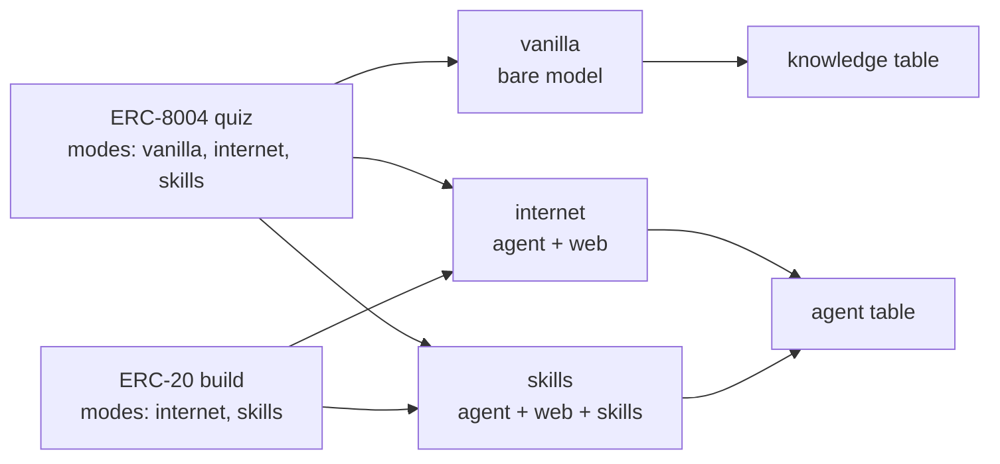
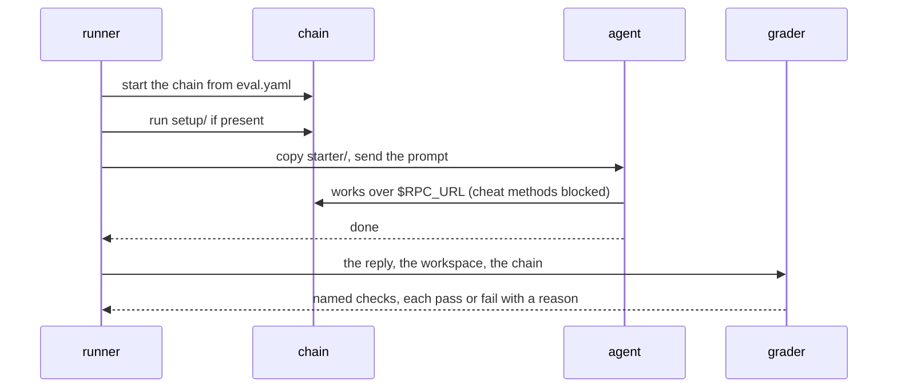
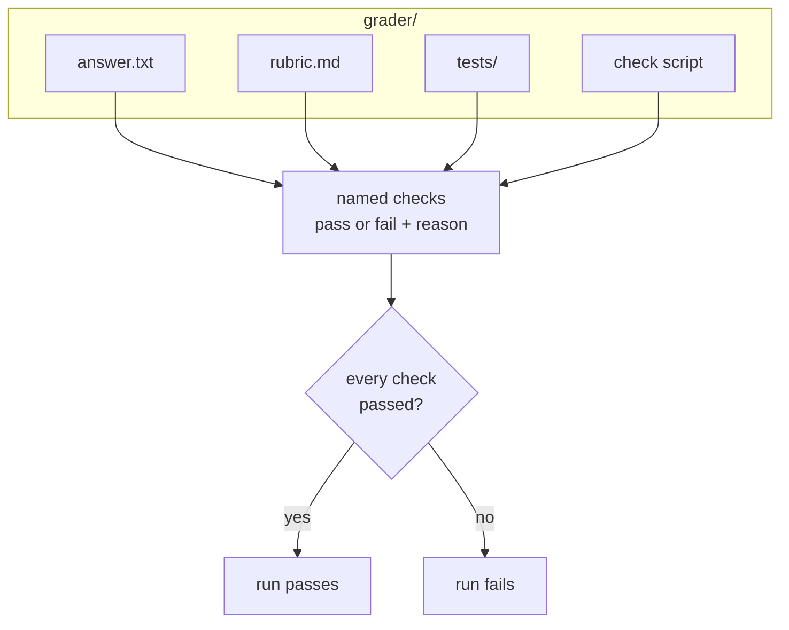
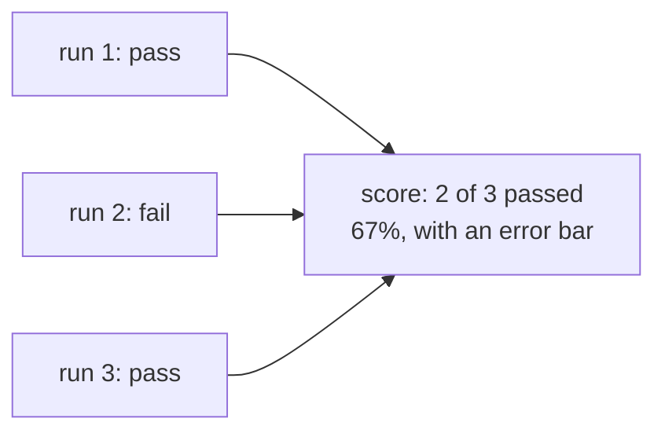

# Eval spec (draft)

This page describes the format of one eval: what goes in the folder, what reaches the agent, and how a run passes. It covers the small core that every eval shares. Anything we will only learn by writing and running evals stays out until we learn it. The terms are defined in [`CONTEXT.md`](../CONTEXT.md), and the reasons behind the shape are in [`docs/adr/`](adr/).

## The spec at a glance

```text
CORE (small on purpose, hard to change)
├── one folder per eval: eval.yaml, starter/, setup/, grader/
├── only the prompt and starter/ reach the agent
├── every grader returns named checks; a run passes if all of them pass
├── modes: a per-eval list
└── chain: named keys in eval.yaml; the agent finds it at $RPC_URL

GROWS BY ADDING (nothing in the core changes)
├── a new grader kind
├── a new mode
├── a new chain key
└── a new type

OPEN (needs a decision)
└── mode names, prompt style, canaries and a held-out set

PARKED (waits until a real eval needs it)
└── answer matching, setup addresses, reference solutions, latest-block forks, several chains
```

## An eval is one folder

Evals are grouped by pillar: `concepts`, `transactions`, `building`, or `security`.

```text
evals/
└── <pillar>/
    └── <eval-name>/
        ├── eval.yaml     # metadata and the prompt
        ├── starter/      # optional: files copied into the agent's workspace
        ├── setup/        # optional: a script that prepares the chain
        └── grader/       # everything that decides pass or fail
```

## Only the prompt and starter/ reach the agent

The runner sends the prompt as the agent's message and copies `starter/` into its workspace. Nothing else in the folder reaches the agent. If the eval asks for a chain, the agent finds it at `$RPC_URL`.


## eval.yaml

| Field | Required | What it holds |
|---|---|---|
| `type` | yes | What the agent does: `quiz`, `scenario`, `build`, or `act`. |
| `modes` | yes | The modes this eval runs in: any of `vanilla`, `internet`, and `skills`. |
| `motivation` | yes | One line on why this eval exists. |
| `prompt` | yes | The message the agent receives. |
| `chain` | no | The chain this eval needs. Leave it out for no chain. |

### Example: a quiz

A quiz is `eval.yaml` plus its answer in `grader/`.

```text
evals/concepts/erc-8004-number/
├── eval.yaml
└── grader/answer.txt   # 8004
```

```yaml
type: quiz
modes: [vanilla, internet, skills]
motivation: ERC-8004 is new, so a model without the web or skills likely doesn't know it.
prompt: |
  which ERC gives AI agents onchain identity, reputation and validation registries?
  reply with just the number, nothing else.
```

### Example: a build

A build carries its details in `starter/` and can hold more than one grader.

```text
evals/building/erc20-points-token/
├── eval.yaml
├── starter/SPEC.md             # name, symbol, supply, who can mint
└── grader/
    ├── rubric.md               # uses OpenZeppelin, mint is owner-only
    └── tests/PointsToken.t.sol # supply, decimals, a non-owner can't mint
```

```yaml
type: build
modes: [internet, skills]
motivation: The most common thing people ask an agent to build. Checks it uses OpenZeppelin instead of writing its own token code.
prompt: |
  make an ERC-20 for our community points. details are in SPEC.md
```

## Modes decide who runs and where the score goes

| Mode | Who runs | What it can reach |
|---|---|---|
| `vanilla` | the bare model, no harness | nothing: one question, one reply |
| `internet` | an agent | the web, a shell, its workspace, and the eval's chain |
| `skills` | an agent | everything in `internet`, plus Ethereum skills |

Only quizzes can list `vanilla`, because a bare model has no agent loop and can only answer. Vanilla results go in their own table, because they measure what a model knows, not what an agent can do.



A quiz that lists all three modes shows three steps: what the model remembers, what an agent finds by searching, and what skills add. Mode names may change.

## One run, start to finish

This is what happens when one agent attempts one eval in one mode. The chain steps apply only when `eval.yaml` has a `chain` key.



## Graders return named checks

`grader/` holds everything that decides whether a run passed. Every grader, whatever its kind, returns a list of named checks. Each check is pass or fail with a one-line reason.



These grader kinds exist today:

| File in `grader/` | For | What it checks |
|---|---|---|
| `answer.txt` | quizzes | The whole reply, trimmed, equals the file's content. "not 8004" fails. |
| `rubric.md` | any type | An LLM judge answers each bullet with pass or fail and a reason. One bullet is one check. |
| `tests/` | builds | Hidden tests run against the agent's workspace. One test is one check. |
| a check script | acts | A script reads the chain after the run and returns checks. The author picks the language. |

## Chain

An eval that needs a chain says so in `eval.yaml`. The key names follow Hardhat and anvil:

```yaml
chain: { fork: mainnet, block: 21000000 }   # a fork, pinned to a block
chain: { fork: none }                       # a fresh local chain
```

The chain runs apart from the agent. The agent reaches it only at `$RPC_URL`, and the grader reads it after the run.

```text
┌──────────────────┐   RPC   ┌──────────────────┐
│ agent            │ ──────▶ │ chain            │
│ starter/ copied  │         │ setup/ ran first │
└──────────────────┘         └──────────────────┘
                                      ▲
                     grader ──────────┘ reads the chain after the run
```

The chain blocks test-only methods such as `anvil_setBalance`, `anvil_setStorageAt`, and `anvil_impersonateAccount`. Without the block, an agent asked to swap ETH for USDC could write a USDC balance straight into storage and pass without swapping.

To start the agent in a prepared world, add a script in `setup/`. It runs against the chain before the agent starts, for example to deploy the vault an agent has to exploit. The author picks the language, and the script never reaches the agent.

| Chain case | Example eval | Supported |
|---|---|---|
| no chain | a quiz | yes |
| a fresh local chain | deploy your ERC-20 | yes |
| a local chain with setup | exploit a deployed vault | yes |
| a fork at a pinned block, mainnet or an L2 | swap on Uniswap | yes |
| a fork at the latest block | "what is the current base fee?" | not yet: the correct answer changes between runs, so runs can't be compared |
| several chains | bridge to Base | not yet: none of the first evals needs it |

## Scoring

Each eval runs several times per agent and mode. Its score is the share of runs that passed, shown with an error bar. Every result records a hash of the eval's files, so results from a changed eval never mix with older ones.



## How the spec grows

Each of these is an addition. Nothing already written has to change.

| To add | Add |
|---|---|
| a new way to grade | a new file kind in `grader/` that returns named checks |
| a new mode | a new value for `modes` |
| a new chain need | a new key under `chain` |
| a new kind of task | a new value for `type` |

## Open

These still need a decision:

- Mode names. The current names may change.
- How prompts are written: length, tone, and what goes in `starter/` instead.
- A canary string and a release date per eval, and a private held-out set.

## Parked

These wait on purpose until a real eval needs them:

- Answer matching beyond an exact match, such as any order or a pattern.
- How addresses deployed by `setup/` reach the agent.
- A reference solution per eval that must pass its own grader.
- Forks at the latest block, and several chains in one eval.
