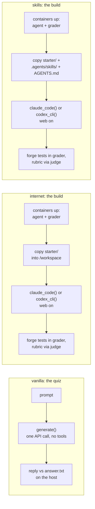
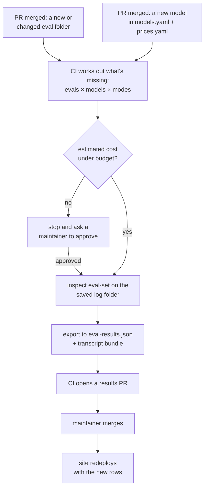

# ethevals on inspect: one eval, three modes, the erc-20 points token

Labels: **measured** means checked on 2026-09-28; **inferred** means reasoned from what we checked; **guess** means no evidence; **illustrative** means a made-up example.

Companion to [the ETH Evals system proposal](./ethevals-proposal.md). Research date 2026-09-28.

Code is illustrative unless it says "copied from". Nothing was installed or run, except `cast sig` to check a quiz answer.

## The short version

We take one small eval, the ERC-20 points token from our spec, and follow it through Inspect in all three modes. We see the files an author writes, the command you type, what prints at the end, and what lands in the log and on our site.

One catch comes first. A build eval can't run in vanilla, because the draft spec (PR #4) says "Only quizzes can list `vanilla`, because a bare model has no agent loop and can only answer" (measured). So vanilla gets a small companion quiz about ERC-20, and the build runs in internet and skills.

## Part 1: the two eval folders

```text
evals/
├── concepts/erc20-transferfrom-selector/   # quiz: vanilla, internet, skills
│   ├── eval.yaml
│   └── grader/answer.txt
└── building/erc20-points-token/            # build: internet, skills
    ├── eval.yaml
    ├── starter/SPEC.md
    └── grader/
        ├── rubric.md
        └── tests/PointsToken.t.sol
```

### The quiz

`eval.yaml` uses our spec's real fields (illustrative content):

```yaml
type: quiz
modes: [vanilla, internet, skills]
motivation: Agents build transferFrom calldata by hand all the time. A wrong selector sends a call that silently does nothing useful.
prompt: |
  what is the 4-byte function selector of the ERC-20 function transferFrom(address,address,uint256)?
  reply with just the selector, lowercase, starting with 0x. nothing else.
```

`grader/answer.txt` holds `0x23b872dd`. That answer is measured: `cast sig "transferFrom(address,address,uint256)"` prints it. The prompt asks for lowercase because our `answer.txt` grader is an exact match after trimming (measured, the draft spec (PR #4)).

### The build

These three files are copied from the draft spec (PR #4), plus one suggested line.

`eval.yaml`:

```yaml
type: build
modes: [internet, skills]
motivation: The most common thing people ask an agent to build. Checks it builds on OpenZeppelin instead of writing its own token code.
prompt: |
  make an ERC-20 for our community points. details are in SPEC.md
```

`starter/SPEC.md`:

```md
- Foundry project, contract `PointsToken` in `src/PointsToken.sol`
- name "Buidl Points", symbol "BPT", 18 decimals
- 1,000,000 BPT minted to the deployer
- the owner can mint more with `mint(address to, uint256 amount)`, nobody else can
- the constructor takes no arguments, and the deployer becomes the owner   <- suggested addition
```

The last line is new, and it fixes a real gap in the spec. OpenZeppelin 5's `Ownable` takes `constructor(address initialOwner)` (measured, `Ownable.sol:38`). If the agent writes `constructor(address owner)`, our hidden test's `new PointsToken()` won't compile, and every check fails for the wrong reason (inferred).

`grader/rubric.md`:

```md
- The token imports `ERC20` and `Ownable` from OpenZeppelin. It doesn't copy them or write its own transfer logic.
- The contract adds nothing that SPEC.md doesn't ask for.
```

`grader/tests/PointsToken.t.sol` is illustrative, but every forge-std call in it was checked against the forge-std source (measured):

```solidity
// SPDX-License-Identifier: MIT
pragma solidity ^0.8.20;

import {Test} from "forge-std/Test.sol";
import {PointsToken} from "../../src/PointsToken.sol";

contract PointsTokenTest is Test {
    PointsToken token;
    address deployer = makeAddr("deployer");
    address alice = makeAddr("alice");

    function setUp() public {
        vm.prank(deployer);
        token = new PointsToken();
    }

    function test_name_symbol_and_decimals() public view {
        assertEq(token.name(), "Buidl Points");
        assertEq(token.symbol(), "BPT");
        assertEq(token.decimals(), 18);
    }

    function test_deployer_holds_1m_bpt() public view {
        assertEq(token.balanceOf(deployer), 1_000_000e18);
    }

    function test_owner_can_mint() public {
        vm.prank(deployer);
        token.mint(alice, 50e18);
        assertEq(token.balanceOf(alice), 50e18);
    }

    function test_non_owner_cannot_mint() public {
        vm.prank(alice);
        vm.expectRevert();
        token.mint(alice, 1e18);
    }
}
```

One run of the build gives six checks, four from the tests and two from the rubric. The run passes only if all six pass (measured, the draft spec (PR #4)). This eval needs no chain container, because forge runs the tests in its own in-memory EVM (inferred).

## Part 2: what changes per mode



| | vanilla | internet | skills |
|---|---|---|---|
| Eval | the quiz | the build | the build |
| Inspect solver | `generate()`, one model call | `claude_code()` or `codex_cli()` | same as internet |
| Containers | none | `default` (agent) and `grader` | same as internet |
| Copied into `/workspace` | nothing | `starter/` | `starter/`, `.agents/skills/`, `AGENTS.md` |
| Network | none needed | web on | web on |
| Graders | `answer.txt`, on the host | forge tests in `grader`, rubric by a judge model | same as internet |
| Site table | knowledge table | agent table | agent table |

Internet and skills differ only by three copied paths. That matches the rule in the draft spec (PR #4), "`skills` = everything in `internet`, plus Ethereum skills" (measured).

### The glue that makes the modes (illustrative)

The loader picks which files to copy:

```python
files = {}
if mode != "vanilla" and (d / "starter").is_dir():
    files["/workspace"] = str(d / "starter")
if mode == "skills":
    files["/workspace/.agents/skills"] = str(SKILLS)
    files["/workspace/AGENTS.md"] = str(AGENTS_MD)

samples.append(Sample(
    id=f"{d.parent.name}/{d.name}",          # "building/erc20-points-token"
    input=spec["prompt"],
    target=answer.read_text().strip() if answer.exists() else "",
    files=files or None,
    metadata={"pillar": d.parent.name, "type": spec["type"], "hash": eval_hash(d)},
    sandbox=None if mode == "vanilla" else ("docker", "compose/build.yaml"),
))
```

The task picks the solver:

```python
@task
def ethevals(mode="skills", agent="claude_code", pillar=None):
    if mode == "vanilla":
        solver = generate()
    elif agent == "claude_code":
        solver = claude_code(cwd="/workspace", version="sandbox")
    else:
        solver = codex_cli(cwd="/workspace", version="sandbox", web_search="live")
    return Task(
        dataset=load_evals(mode=mode, pillar=pillar),
        solver=solver,
        scorer=named_checks(),
        model_roles={"grader": "openai/gpt-6-astra"},
    )
```

The default judge in `model_roles` matters. Without it, Inspect falls back to the model under test as the judge, and the model would grade itself (measured, `docs/models.qmd`: "By default if there is no 'grader' role specified, the default model for the evaluation will be returned").

The compose file for evals with no chain has two containers:

```yaml
services:
  default:                        # the agent; Inspect needs a service named "default"
    image: ethevals/agent:0.1     # node, git, foundry, pinned claude and codex
    x-local: true
    working_dir: /workspace
    command: ["tail", "-f", "/dev/null"]
    volumes: [workspace:/workspace]
  grader:
    image: ethevals/grader:0.1    # foundry + forge-std + openzeppelin, compiles offline
    x-local: true
    command: ["tail", "-f", "/dev/null"]
    volumes: ["workspace:/workspace:ro"]
    network_mode: none
volumes:
  workspace: {}
```

## Part 3: the commands

Every flag below is checked in Inspect's CLI source (measured, `_cli/eval.py`). The model ids `claude-opus-5` and `gpt-6-astra` are in Inspect's model list (measured). The Kimi id is a guess.

```bash
# vanilla: the quiz on one model, 3 runs
inspect eval runner/tasks.py@ethevals \
  -T mode=vanilla \
  --sample-id concepts/erc20-transferfrom-selector \
  --model anthropic/claude-opus-5 \
  --epochs 3 --model-cost-config prices.yaml \
  --log-dir logs/vanilla

# internet: the build with Claude Code, 3 runs, a $5 cap per run
inspect eval runner/tasks.py@ethevals \
  -T mode=internet -T agent=claude_code \
  --sample-id building/erc20-points-token \
  --model anthropic/claude-opus-5 --model-role grader=openai/gpt-6-astra \
  --epochs 3 --no-epochs-reducer \
  --time-limit 1800 --cost-limit 5 --model-cost-config prices.yaml \
  --log-dir logs/dev

# skills: the same build with Codex
inspect eval runner/tasks.py@ethevals \
  -T mode=skills -T agent=codex_cli \
  --sample-id building/erc20-points-token \
  --model openai/gpt-6-astra --model-role grader=anthropic/claude-opus-5 \
  --epochs 3 --no-epochs-reducer \
  --time-limit 1800 --cost-limit 5 --model-cost-config prices.yaml \
  --log-dir logs/dev
```

The flags that matter most:
- `-T key=value` passes arguments to our `@task`, like the mode and the agent.
- `--sample-id` picks the eval to run. The id is the folder path, like `concepts/erc20-transferfrom-selector`. Globs work too: `--sample-id "concepts/*"` runs every concepts quiz. Leave the flag out and the task runs every eval that lists that mode.
- `--model a,b,c` takes a comma list to run the same evals on several models. Each model gets its own result block and its own log file.
- `--epochs 3` runs each eval three times.
- `--no-epochs-reducer` keeps each run separate, which gives the "2 of 3 passed" error bar (Part 4 explains).
- `--cost-limit 5` stops one run at $5. It needs prices for every model.
- `--model-cost-config` is our price file. Inspect ships no prices (measured).

The price file looks like this. The format is measured, and the prices are placeholders:

```yaml
anthropic/claude-opus-5:       { input: 5.00, output: 25.00, input_cache_write: 6.25, input_cache_read: 0.50 }
openai/gpt-6-astra:            { input: 1.25, output: 10.00, input_cache_write: 0,    input_cache_read: 0.125 }
openrouter/moonshotai/kimi-k3: { input: 0.60, output: 2.50,  input_cache_write: 0,    input_cache_read: 0.15 }
```

## Part 4: what comes out

### What prints at the end

When a command finishes, Inspect prints a summary block in the terminal. The two blocks below are what the vanilla command and the skills command from Part 3 would print. The layout is Inspect's real end-of-run layout, rebuilt from its display code (measured, `_display/core/results.py`). The numbers are illustrative.

Two words to know first:
- **Sample.** Inspect calls one run of one eval a "sample". The title `ethevals (1 x 3 samples)` means 1 eval × 3 runs (`--epochs 3`), so 3 samples in total. If `--sample-id "concepts/*"` matched 10 quizzes, it would read `10 x 3 samples`.
- **The model lines.** Each block covers one model under test, named in the title. Any other model listed under `total time` is a helper, and the only helper we use is the judge.

After the vanilla command (the quiz, Claude Opus 5, 3 runs):

```text
╭──────────────────────────────────────────────────────────────────────────────╮
│ethevals (1 x 3 samples): anthropic/claude-opus-5                             │
╰──────────────────────────────────────────────────────────────────────────────╯
epochs: 3, mode: vanilla, pillar: concepts, dataset: ethevals-vanilla

total time:                  0:00:19
anthropic/claude-opus-5      2,214 tokens [I: 312, O: 1,902, R: 1,860]

named_checks
accuracy      1.000
stderr        0.000

Log: logs/vanilla/2026-09-28T13-40-02+05-30_ethevals_Qm7fT2kVx9LrHcNpB4sWdA.eval
```

Only one model shows, because the quiz is graded by `answer.txt` and needs no judge.

After a skills run of the build with Claude Code and Claude Opus 5 as the model under test. It's the same shape as the Codex command in Part 3, with `-T agent=claude_code`:

```text
╭──────────────────────────────────────────────────────────────────────────────╮
│ethevals (1 x 3 samples): anthropic/claude-opus-5                             │
╰──────────────────────────────────────────────────────────────────────────────╯
epochs: 3, epochs_reducer: none, time_limit: 1800, cost_limit: 5.0, mode: skills, agent: claude_code,
dataset: ethevals-skills

total time:                  0:21:07
anthropic/claude-opus-5      2,431,880 tokens [I: 18,204, CW: 312,551, CR: 2,040,337, O: 60,788, R: 21,440]
openai/gpt-6-astra           9,912 tokens [I: 8,640, CW: 0, CR: 0, O: 1,272, R: 896]

grader (role)                9,912 tokens [I: 8,640, CW: 0, CR: 0, O: 1,272, R: 896]

named_checks
accuracy      0.667
stderr        0.333

Log: logs/dev/2026-09-28T14-02-11+05-30_ethevals_UyP3kQ9bH2cRkXnTzV7sLm.eval
```

How to read these:
- **Why GPT-6 Astra shows up in a Claude run.** It's the judge, not a second model under test. One run still tests one model, Claude Opus 5, named in the title. The rubric checks ("built on OpenZeppelin", "adds nothing beyond SPEC.md") need a model to read the code and answer pass or fail. That judge was set with `--model-role grader=openai/gpt-6-astra`. Inspect lists every model that made calls, then repeats the judge's usage on its own `grader (role)` line, so the judge's tokens never mix with the tested model's.
- **The token letters.** I is input, CW is cache write, CR is cache read, O is output, and R is reasoning.
- **Tokens, not dollars.** The terminal shows only tokens. Dollars show in the viewer and in the log (measured).
- **Why vanilla shows `stderr 0.000`.** This is real behaviour, not a typo. By default, the three runs of one eval are averaged into one number first, and the error of a single number is zero (measured, `std.py`). That's why the build command uses `--no-epochs-reducer`: two passes and one fail give 0.667 with an error bar of 0.333.

If a run is cancelled, Inspect prints the resume command (measured, real message):

```text
Task interrupted (2 of 3 total samples logged before interruption). Resume task with:

inspect eval-retry logs/dev/2026-09-28T14-02-11+05-30_ethevals_UyP3kQ9bH2cRkXnTzV7sLm.eval
```

### What lands in the log for one run

Here is run 2 of 3 of the skills build, trimmed. The field names are real Inspect fields, and the values are illustrative. The shape follows a real log in Inspect's test folder (measured).

```json
{
  "id": "building/erc20-points-token",
  "epoch": 2,
  "scores": {
    "named_checks": {
      "value": "I",
      "metadata": {
        "checks": [
          { "name": "name symbol and decimals", "pass": true,  "reason": "passed" },
          { "name": "deployer holds 1m bpt",    "pass": true,  "reason": "passed" },
          { "name": "owner can mint",           "pass": true,  "reason": "passed" },
          { "name": "non owner cannot mint",    "pass": true,  "reason": "passed" },
          { "name": "built on OpenZeppelin",    "pass": true,  "reason": "imports ERC20 and Ownable from @openzeppelin/contracts" },
          { "name": "adds nothing beyond SPEC.md", "pass": false, "reason": "adds a burn(uint256) function that SPEC.md does not ask for" }
        ]
      }
    }
  },
  "model_usage": {
    "anthropic/claude-opus-5": { "input_tokens": 6012, "output_tokens": 20441, "input_tokens_cache_read": 680637, "total_cost": 1.5144 }
  },
  "role_usage": { "grader": { "total_tokens": 3304, "total_cost": 0.0078 } },
  "total_time": 431.7,
  "turn_count": 38,
  "events": [
    {
      "event": "model",
      "model": "anthropic/claude-opus-5",
      "output": { "choices": [{ "message": { "tool_calls": [
        { "function": "Bash", "arguments": { "command": "forge test -vv" } } ] } }] },
      "call": {
        "request":  { "model": "claude-opus-5", "max_tokens": 32000, "system": ["..."], "messages": ["..."], "tools": ["..."] },
        "response": { "id": "msg_...", "stop_reason": "tool_use", "usage": { "input_tokens": 212, "output_tokens": 311 } }
      }
    }
  ]
}
```

Every Claude Code turn becomes one `model` event, so this run has 38 of them (measured that each bridged call becomes a model event). The `call` part holds the raw request and response. The next part covers that.

### What our site gets

Our exporter turns each run into one row of `eval-results.json`. The shape follows Supabase's real file, which has one row per run (measured, `supabase/evals/.../eval-results.json`). The field names are our proposal:

```json
{
  "eval": "building/erc20-points-token",
  "evalHash": "3f9c1a7e02bd",
  "pillar": "building",
  "mode": "skills",
  "agent": { "harness": "claude-code", "model": "anthropic/claude-opus-5" },
  "run": 2,
  "passed": false,
  "checks": [ "...the six checks above..." ],
  "skills": { "available": ["ethskills"], "opened": [] },
  "usage": { "outputTokens": 20441, "cacheReadTokens": 680637, "costUsd": 1.51 },
  "judgeCostUsd": 0.01,
  "timeSec": 432,
  "transcript": "transcripts/#/logs/...eval/samples/sample/building%2Ferc20-points-token/2"
}
```

`skills.opened` comes from scanning the log's model events for reads of `.agents/skills/` (inferred). That is how we'd catch the problem from the ethskills audit, where Claude Code never opened the skill in 9 of 9 runs (measured).

## Part 5: what Inspect gives us for free

Ranked by how much each one saves us (all measured in source or docs):

| # | Feature | What it means for us |
|---|---|---|
| 1 | Every model call is in the log, including Claude Code's calls through the proxy | We see every turn of every run, and can prove whether the agent opened the skill |
| 2 | Resume at four levels | A crashed or cancelled run never pays again for finished work |
| 3 | Dollar cost per call, run, model and judge, plus a per-run cap | A cost number for every cell on the board, and a runaway agent stops at $5 |
| 4 | `inspect view`, and `inspect view bundle` as a static site | A transcript page behind every result, with no code from us |
| 5 | Repeats and error bars | "2 of 3 passed, with an error bar" is two flags |
| 6 | Limits on time, messages, turns, tokens and dollars | Per-run caps without writing a watchdog |
| 7 | Debug tools | A shell inside the exact container a failed agent left behind |
| 8 | A judge role | The judge is picked per run, and its cost is reported separately |
| 9 | OpenRouter and the other providers | Open models like GLM, Kimi and DeepSeek through one key |
| 10 | Batch mode and a local cache | About half price for vanilla quizzes, and free re-runs while fixing a grader |

### "Can we continue the same eval?" Yes, four ways

1. **`inspect eval-retry <log>`** re-runs a failed or cancelled log and keeps the runs that already finished.
2. **Running `inspect eval-set` again** schedules only the unfinished work. Adding a model or a new eval runs only the additions.
3. **Crash recovery.** If the process dies, `inspect log recover` rebuilds the log from a buffer on disk.
4. **Mid-run checkpoints** (`--checkpoint`) save the agent's conversation and chosen folders as it works. A retry then resumes Claude Code with `--resume <session id>` instead of starting over. We'd add `/workspace` to the saved folders (measured, `docs/checkpointing.qmd`, inspect_swe 0.2.65).

A 30-minute build that dies at minute 25 doesn't start over, and a board run that fails halfway costs only the missing half (inferred).

One caveat: if an eval is edited but keeps the same id, Inspect reuses the old result. That's why CI passes the eval's hash as a task argument (measured).

### Dollar cost

- **What gets costed.** Give Inspect the price file once, and it computes the cost of every call. It adds these up per run, per model and for the judge.
- **Where you see it.** The viewer shows total cost and average cost per run for each model.
- **The cap.** `--cost-limit 5` is checked on every model call and stops that run at $5.
- **What's missing.** It ships no prices, has no cap for a whole run, and doesn't print dollars in the terminal.

### The debug loop

```bash
# keep the containers of a failed run and look inside
inspect eval ... --sample-id building/erc20-points-token --epochs 1 --no-sandbox-cleanup
docker exec -it <container id printed at the end> bash -l
inspect sandbox cleanup docker            # remove leftovers later

# watch HTTP requests as they happen
inspect eval ... --log-level http
```

## Part 6: `generate()` and raw model calls

### Yes, `generate()` is Inspect's

`generate()` is a built-in Inspect solver (measured, `solver/_solver.py:271`). Here is the path from it down to the real Anthropic API call, all measured:

```text
generate()                        solver/_solver.py:271       the solver our task lists
  runner's generate(state)        _eval/task/run.py:1230
    task_generate(...)            _eval/task/generate.py:11   loops while the model asks for tools
      Model.generate(...)         model/_model.py:925         cache check, retries with backoff
        AnthropicAPI.generate     model/_providers/anthropic.py:716
          builds one request dict    anthropic.py:741         "assembled this way so we can log the raw model call"
          client.messages.create(**request)                   the real Anthropic SDK call
        tokens and dollars recorded, limits checked           model/_model.py:2957
```

In the agent modes, the path joins in the middle. Claude Code in the container sends its request to the proxy, the proxy passes it to the host, and it enters the same `Model.generate` (measured, `agent/_bridge/util.py:576`). That's why agent runs get the same retries, costs and logs as a plain call.

### Can we see the raw request and response?

Yes. Each model event carries a `call` with the `request` Inspect sent to the provider's SDK and the `response` it got back (measured, `model/_model_call.py`). Three limits:

- **How many are kept.** By default, the first 5 raw calls per model per run keep their raw JSON, plus every failed call. `--log-model-api` keeps them all. An agent run has dozens of calls, so we'd turn it on for the first real runs (measured).
- **It isn't the bytes on the wire.** It is the JSON body Inspect hands the SDK, without HTTP headers or the API key (inferred).
- **In agent modes, it is Inspect's request, not Claude Code's.** The proxy turns Claude Code's request into Inspect messages and makes a new provider call, so the log shows that new call (inferred from the proxy code).

### Can we call a model without writing an eval?

Yes. This is copied from Inspect's own tests (`tests/model/test_reasoning_claude.py:64-68`):

```python
model = get_model("anthropic/claude-opus-5")
output = await model.generate(
    "Solve 3*x^3-5*x=1",
    config=GenerateConfig(reasoning_effort="low", max_tokens=8192),
)
```

It's async, so a plain script wraps it in `asyncio.run(...)`. Retries and token counting work the same as inside an eval (inferred).

## Part 7: automation, for a new eval and for a new model

The goal: merging an eval runs it on every model and updates the site. Adding a model runs every eval on it. Nothing here exists yet. The design is ours (inferred), and it rests on three Inspect behaviours (measured):
- **Only what's missing runs.** Running `eval-set` again on the same log folder runs only the (task, model) pairs that aren't finished.
- **Task arguments are part of a run's identity.** Inspect names each finished run by a hash of its task arguments.
- **A grown dataset tops up.** Since 0.3.270, adding samples runs only the new ones.

### The two files CI reads

Both live in our GitHub repo (illustrative):

```yaml
# models.yaml: who is on the board
judge: openai/gpt-6-astra
models:
  - id: anthropic/claude-opus-5
    agents: [claude_code]          # agent modes run through Claude Code
  - id: openai/gpt-6-astra
    agents: [codex_cli]
  - id: openrouter/moonshotai/kimi-k3
    agents: []                     # vanilla only
```

```yaml
# prices.yaml: dollars per million tokens, needed for cost and the budget gate
anthropic/claude-opus-5:       { input: 5.00, output: 25.00, input_cache_write: 6.25, input_cache_read: 0.50 }
openai/gpt-6-astra:            { input: 1.25, output: 10.00, input_cache_write: 0,    input_cache_read: 0.125 }
openrouter/moonshotai/kimi-k3: { input: 0.60, output: 2.50,  input_cache_write: 0,    input_cache_read: 0.15 }
```

### One pipeline, two triggers



Both triggers feed the same job. The only difference is what's missing: a new eval is missing for every model, and a new model is missing for every eval (inferred).

### Case 1: we merge the PR that adds `erc20-points-token`

**Before the merge**, the PR runs a check job with no model calls and no cost:
- It checks the folder against the spec, including `eval.yaml` fields and that the modes are allowed for the type.
- It runs the grader self-test. The hidden tests must compile, `rubric.md` must parse, and `answer.txt` must exist for quizzes.

A broken eval never gets merged.

**After the merge**, CI works out what's missing. The eval lists `[internet, skills]`, and two models have agents, so that's 2 models × 2 modes × 3 runs = 12 runs. Kimi is skipped, because it's vanilla-only and a build can't run in vanilla.

For one eval, the run is the same `inspect eval-set` command you'd type:

```bash
inspect eval-set runner/tasks.py@ethevals \
  -T mode=skills -T agent=claude_code \
  -T eval=building/erc20-points-token -T eval_hash=3f9c1a7e02bd \
  --model anthropic/claude-opus-5 --model-role grader=openai/gpt-6-astra \
  --epochs 3 --no-epochs-reducer --cost-limit 5 --model-cost-config prices.yaml \
  --log-dir logs/board
```

CI doesn't type four of those. It runs one Python script that builds every missing combination and hands them to `eval_set` in one call (illustrative; `eval_set` and its arguments are real):

```python
# runner/ci_run.py (illustrative)
from inspect_ai import eval_set
from ethevals_inspect.tasks import ethevals

tasks = []
for ev in changed_evals():                         # from git diff: ["building/erc20-points-token"]
    for m in board["models"]:
        for mode in ev.modes:                      # ["internet", "skills"]
            if mode == "vanilla" or m["agents"]:
                agent = m["agents"][0] if m["agents"] else None
                # our @task passes model= through to Task(model=...), so each task carries its own model
                tasks.append(ethevals(mode=mode, agent=agent, eval=ev.id, eval_hash=ev.hash, model=m["id"]))

success, logs = eval_set(
    tasks=tasks,
    log_dir="logs/board",                          # the saved folder, downloaded before and uploaded after
    model_roles={"grader": board["judge"]},
    epochs=3, model_cost_config="prices.yaml", cost_limit=5,
)
```

`eval_hash` is a task argument on purpose. If someone later edits the eval, its hash changes, so the run gets a new identity and runs again. Without it, Inspect would reuse the old results for the edited eval (measured that reuse keys on the task arguments).

Then CI exports the new logs and opens a results PR. The title is the kind of line a maintainer can decide on (illustrative):

```text
results: add building/erc20-points-token (12 runs, 4 agents, $14.20)

claude-code · opus-5    internet 2/3   skills 3/3
codex · gpt-6-astra     internet 1/3   skills 2/3
```

When the maintainer merges, the site redeploys, and the eval appears in the building pillar with a cell for each agent (inferred). Each cell links to its transcripts.

### Case 2: Anthropic releases Opus 5.5, and we add it

The PR is two lines, plus one row in the price file:

```diff
 # models.yaml
 models:
   - id: anthropic/claude-opus-5
     agents: [claude_code]
+  - id: anthropic/claude-opus-5-5
+    agents: [claude_code]

 # prices.yaml
+anthropic/claude-opus-5-5: { input: 5.00, output: 25.00, input_cache_write: 6.25, input_cache_read: 0.50 }
```

If the price row is missing, the check job fails, because `--cost-limit` refuses to run a model with no price (measured). So a model can't join the board without a known cost.

After the merge, CI builds the same task list as the last full board run, with the new model added. It runs `eval_set` on the saved log folder. Every existing (task, model) pair is already finished, so Inspect skips it. Only the Opus 5.5 column runs: every eval, in every mode it lists, 3 times each (measured behaviour; the scale is illustrative). For 20 evals that could be 20 vanilla-or-agent evals × about 2 modes × 3 runs, around 120 runs. At a guessed $1 to $1.50 per agent run, that's the budget gate's job to show before anything is spent (guess).

The board then gets a new row (illustrative):

```diff
 Agent                      Concepts   Transactions   Building   Security
 claude-code · opus-5         82%          61%           58%        40%
+claude-code · opus-5.5       88%          67%           66%        47%    new
 codex · gpt-6-astra          79%          64%           55%        44%
```

### Where the logs live between runs

"Only run what's missing" works only if CI can see the old logs. So the log folder has to persist between CI runs, in S3, a release asset, or an HF dataset (inferred). Where it lives is still open.

Each task carries its own model because Inspect's `Task` takes a `model` argument (measured, `_eval/task/task.py:97`). That's how one `eval_set` call can run Claude Code tasks on Anthropic models and Codex tasks on OpenAI models without pairing every task with every model.

## Part 8: what the 2 to 3 day test must check

1. What `forge test --json` really prints, so we can turn it into checks (guess today).
2. Whether the pinned Claude Code reads `AGENTS.md` and `.agents/skills/` on its own, or needs `.claude/skills/` too (guess). Skills-mode numbers for Claude depend on this.
3. One `--checkpoint` run of Claude Code, killed and resumed.
4. Whether the local cache applies to agent calls through the proxy (guess).
5. Add the constructor line to `starter/SPEC.md` in our spec. That one is a spec fix, not a test.
