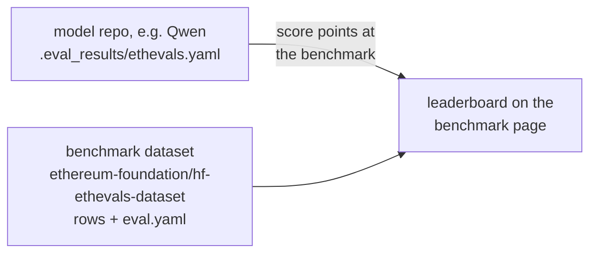
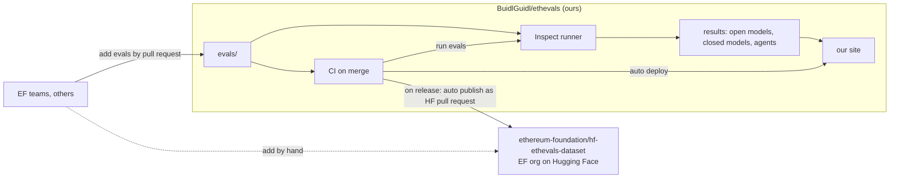
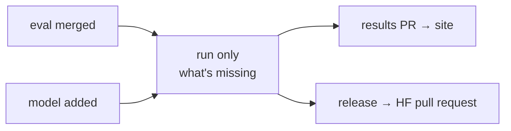

# ETH Evals system proposal

Labels: 
- **measured** means checked on 2026-09-28; 
- **inferred** means reasoned from what we checked; 
- **guess** means no evidence; 
- **illustrative** means a made-up example.

## What each project does

<details>
<summary><strong>Austin's ethevals</strong> (<code>austintgriffith/ethevals</code>)</summary>

- **Intention.** Score agents (Claude Code, Codex, OpenCode), with and without ethskills, across our four pillars.
- **How the evals are written.** There are 100 YAML files, 25 per pillar: 94 quizzes and 6 builds. Austin Griffith's agent clawdbot wrote them in three days, and 60 were ported from ethskills-evals and clawdbot's eth-evals.
- **How it works.**
  ```mermaid
  flowchart LR
      A[eval YAML] --> B["run.py: agent CLI<br/>in a temp folder on the host"] --> C["fixed-answer match<br/>or a Sonnet judge"] --> D["result card,<br/>sent by PR"] --> E[ethevals.com]
  ```
  There's no container and no chain, and each eval runs once.
- **How it shows data.** ethevals.com is one static page with 7 cards. Results arrive by hand-made PRs, with no CI. Nothing is on HF.

</details>

<details>
<summary><strong>EthIQ</strong> (<code>ethpandaops/ai-evals</code>)</summary>

- **Intention.** ethPandaOps built it to test models on protocol internals (EVM, consensus, fork choice) for their own daily work.
- **How the evals are made.** They're generated, not written. Official spec test fixtures get mutated with a seed, and the spec's own reference code computes each answer. There are 376 questions, 325 of them private.
- **How it works.**
  ```mermaid
  flowchart LR
      A["spec fixture + seed"] --> B["question,<br/>answer computed"] --> C["API: plain call<br/>or Agentic: CLI in Docker,<br/>network API-only"] --> D[regex or rubric] --> E[ethiq.ethpandaops.io]
  ```
  The framework is unknown, because the repo is private.
- **How it shows data.** Its own site, ethiq.ethpandaops.io, with confidence intervals, cost, and a page per question. Nothing is on HF.

</details>

<details>
<summary><strong>Wallet evals</strong> (<code>Ethereum-dAI/local-llm-evals</code>)</summary>

- **Intention.** The EF AI team (Gabriel Fior) wants to prove that a fine-tuned 4B Gemma running on the user's device turns "send 0.1 ETH to vitalik.eth" into the right wallet tool call, better than GPT-5.
- **How the evals are made.** Python scripts generate 1000 noisy phrasings from hand-written seeds, and the expected call is computed from the seed. Each case is one model call graded by exact match, with no chain, no MCP, and no agent.
- **How it works.**
  ```mermaid
  flowchart LR
      A[seeds.yaml] --> B["1000 cases,<br/>answer computed"] --> C[promptfoo run] --> D[exact tool-call match] --> E["markdown reports<br/>+ HF dataset"]
  ```
- **How it shows data.** Hand-written reports in the repo. The data sits on HF as `ef-ai/wallet-eval-benchmark`, but in promptfoo's YAML format, so HF can't load it as rows. One person pushed it by hand, with no PRs and no tags.

</details>

<details>
<summary><strong>eth-bench</strong> (<code>JossDuff/eth-bench</code>)</summary>

- **Intention.** Measure how much Ethereum a model knows.
- **How the evals are written.** 343 hand-written questions in 9 sections, of three types: multiple choice, open answer, and false premise, where the model has to reject a made-up fact.
- **How it works.**
  ```mermaid
  flowchart LR
      A[question YAML] --> B["inspect eval,<br/>optional skill or MCP assist"] --> C["letter match or<br/>a separate grader model"] --> D["README table<br/>+ inspect view"]
  ```
- **How it shows data.** A README table, already out of date, and Inspect's local viewer. Nothing is on HF. The licence is a stack of three texts ending in AGPL-3.0, so the questions can't be reused until Joss relicenses them.

<details>
<summary>One real eth-bench question, from <code>questions/hallucination/questions.yaml</code></summary>

```yaml
- id: fake-push0-byzantium
  type: false_premise
  question: |
    The Byzantium upgrade introduced the PUSH0 opcode. Which EIP specified it?
  answer: |
    The premise is false. PUSH0 was introduced by EIP-3855 in the Shanghai
    upgrade (2023), not Byzantium (2017). A correct response points out that
    Byzantium did not introduce PUSH0.
  difficulty: recall
```

The model is asked the question, and a separate grader model compares its reply with `answer`. It returns correct, incorrect, or not attempted.

</details>

</details>

### Side by side

| | Austin's ethevals | EthIQ | Wallet evals | eth-bench |
|---|---|---|---|---|
| Evals | 100, written | 376, generated | 1000, generated | 343, written |
| Framework | own `run.py` | unknown | promptfoo | Inspect |
| Agents in an isolated box | no | yes | no agents | no agents |
| Where the data shows | ethevals.com | own site | HF (not loadable) | README |
| Automation | none | private | none | none |


<details>

<summary>
  
## A bit about Hugging Face

</summary>

HF hosts two things we care about.

- **Models.** Weights plus a card. Example: the EF's fine-tuned wallet model, https://huggingface.co/ef-ai/gemma-4-E4B-wallet-ft-v5.
- **Datasets.** Data files plus a card. A dataset that adds an `eval.yaml` becomes a **benchmark** with a leaderboard on its page. Examples: the EF's wallet benchmark, https://huggingface.co/datasets/ef-ai/wallet-eval-benchmark, and MMLU-Pro, https://huggingface.co/datasets/TIGER-Lab/MMLU-Pro, which lists 141 models.

The flow that matters: **a score lives in the model's repo, not in the benchmark's.** To put a model on a leaderboard, someone adds a small file, `.eval_results/<benchmark>.yaml`, to that model's repo, usually through a pull request. The benchmark page then collects it. See https://huggingface.co/Qwen/Qwen3.5-397B-A17B/discussions/9, where an HF staff member proposes Qwen's MMLU-Pro score.



This makes HF good for **open models** only. Claude, GPT, or "Claude Code with skills" have no model repo, so they can't appear. HF is built around models, not agents, so an HF leaderboard could only show our vanilla quizzes (inferred). Our site stays the board for frontier models and agents.

<details>
<summary>What one row of <code>data/concepts/test.jsonl</code> would look like (illustrative)</summary>

```json
{"id": "concepts/erc-8004-number", "pillar": "concepts", "type": "quiz", "prompt": "which ERC gives AI agents onchain identity, reputation and validation registries?\nreply with just the number, nothing else.", "answer": "8004", "grader": "exact", "eval_hash": "sha256:3f9a...c21e", "source_url": "https://github.com/BuidlGuidl/ethevals/tree/v0.1.0/evals/concepts/erc-8004-number", "added_in": "v0.1.0"}
```

</details>

Why it's worth having there: eval tools read HF directly. With an `eval.yaml` in the dataset, anyone runs our quizzes in one command without cloning our repo:

```bash
inspect eval hf/ethereum-foundation/hf-ethevals-dataset --model openrouter/qwen/qwen3.5-397b-a17b
```

`load_dataset(...)` in Python and promptfoo's `huggingface://` read it too. Pinned tags like `v0.1.0` keep every score comparable, and training pipelines already read from HF, which fits "we want models to train on this".

The EF today: the `ethereum-foundation` org is empty, and the AI team publishes by hand under `ef-ai`.

How we'd publish, step by step, with real examples: [publishing ethevals to Hugging Face](./publishing-ethevals-to-hugging-face.md).


</details>


<details>

<summary>

## A bit about Inspect
    
</summary>

Inspect fits the **runner** part of our system:

- **Isolated runs.** Each run gets fresh containers. For a build eval that means the agent, an anvil chain behind an RPC filter, and a grader the agent can't touch.
- **Agents.** Claude Code and Codex run inside the container, and every model call they make is logged. So we can see whether an agent opened the skill.
- **A judge.** A separate grader model is set per run, so the model under test never grades itself.
- **Scoring.** Repeats with error bars, which gives "2 of 3 runs passed".
- **Cost.** Dollars per run, per model and for the judge, plus a per-run cap.
- **Resume.** Rerunning a set runs only what's missing, and a crashed agent resumes mid-run.
- **Transcripts.** A viewer we can publish as a static site, so every result links to its full transcript.

What it doesn't do is ours to build: the site, the automation trigger, and an eval format people can write without Python. What it costs us: Python, API keys instead of subscription logins, and an agent that is close to stock but not identical. Also, HF's "verified" badge is reserved for Inspect runs, and eth-bench already uses Inspect.

One eval followed through all three modes, with commands, outputs and automation: [ethevals on Inspect: the ERC-20 example](./ethevals-on-inspect-erc20-example.md).

</details>


## Our proposal

Two repos: **`BuidlGuidl/ethevals`** on GitHub is the source: evals, runner, site and automation. **`ethereum-foundation/hf-ethevals-dataset`** on HF is the published copy the EF owns.



We keep our own repo and site because we also eval agents and closed models, not only open models.

<details>
<summary>Repo layout</summary>

```text
ethevals/
├── evals/<pillar>/<name>/      # what authors write: eval.yaml, starter/, setup/, grader/
├── runner/                     # ours, on top of Inspect
│   ├── loader.py               # eval folder → Inspect samples
│   ├── tasks.py                # picks the solver per mode: plain call, Claude Code, Codex
│   ├── scorers.py              # answer, forge tests, rubric → named checks
│   ├── export.py               # Inspect logs → eval-results.json, HF rows
│   └── images/                 # containers: agent, anvil chain, RPC filter, grader
├── site/                       # the public board, reads eval-results.json
├── models.yaml, prices.yaml    # who is on the board, what a token costs
└── .github/workflows/          # check an eval PR, run what's missing, publish to HF
```

</details>

Why this system is worth building:

- **Real chain scenarios:** Build evals run the agent against a real local chain in an isolated box, so we measure whether it actually builds and ships working contracts. None of the four projects does this, and it's what the Building pillar needs (inferred).
- **A framework for every pillar:** Any team adds an eval as a folder, with YAML, Markdown and Solidity tests and no Python. EthIQ-style questions, wallet cases, or eth-bench's false-premise questions all fit one format (inferred).
- **Automated end to end.**
  1. Merge an eval: CI runs it on every model.
  2. Add a model to `models.yaml`: CI runs every eval on it, reusing everything already done.
  3. A budget check runs first.
  4. CI opens a results PR, and the site updates when it's merged.
  5. On each release, CI exports the quiz rows and opens a pull request on the EF's HF dataset for them to review.


