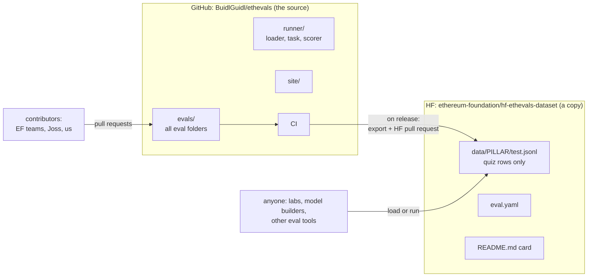
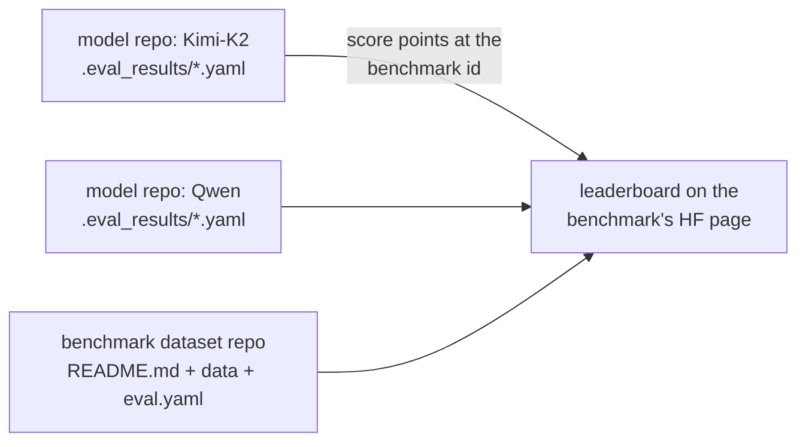
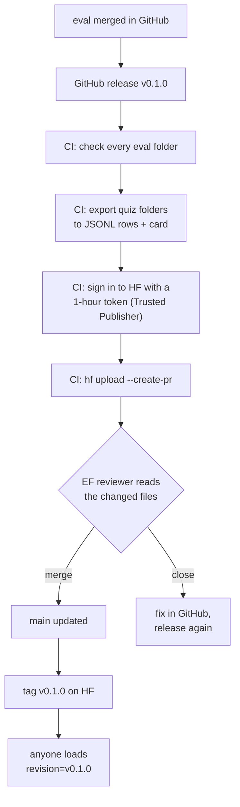

# publishing ethevals to hugging face, with real examples

Labels: **measured** means checked on 2026-09-28; **inferred** means reasoned from what we checked; **guess** means no evidence; **illustrative** means a made-up example.

Companion to [the ETH Evals system proposal](./ethevals-proposal.md). Research date 2026-09-28.

Nothing was created or pushed anywhere.

## The short version

An HF dataset is a git repo holding a card (`README.md`) and data files. Once the files are rows in JSONL, CSV or parquet, anyone can load them with one line of code and browse them on the web (measured).

Our plan is:
1. Evals get written and merged in GitHub, as today.
2. On each release, CI turns the quiz folders into rows and opens a pull request on the EF's HF repo.
3. An EF person reviews it and clicks merge.
4. The version gets a tag, so anyone can pin it.

The EF publishes differently today. One person pushes files by hand, with no review, no tags, and a format HF can't load as rows (measured). Our flow gives the EF the review and the stable releases it asked for (inferred).

## See it on Hugging Face

All of these links loaded today (measured, HTTP 200). Here is an order that tells the story:

1. **A benchmark with its leaderboard.** https://huggingface.co/datasets/TIGER-Lab/MMLU-Pro is MMLU-Pro's page. The leaderboard sits on the page itself, with 141 models today. Qwen3.5-397B-A17B is 4th with 87.8 (measured, `/api/datasets/TIGER-Lab/MMLU-Pro/leaderboard`).
2. **The raw rows.** https://huggingface.co/datasets/TIGER-Lab/MMLU-Pro/viewer shows the questions as a table you can scroll and search.
3. **The file that makes it a benchmark.** https://huggingface.co/datasets/TIGER-Lab/MMLU-Pro/blob/main/eval.yaml
4. **How a Qwen score got onto that board.** https://huggingface.co/Qwen/Qwen3.5-397B-A17B/discussions/9 is an open pull request on Qwen's model page that adds `.eval_results/mmlu_pro.yaml`. An HF staff member opened it, and it is not merged yet. Even so, the leaderboard already shows the score, marked community-provided (measured).
5. **Scores already merged into a model page.** https://huggingface.co/moonshotai/Kimi-K2-Instruct/tree/main/.eval_results holds three YAML files for Terminal-Bench, SWE-bench Pro and Apex-SWE. Click one to see the format.
6. **The EF's own dataset, for contrast.** https://huggingface.co/datasets/ef-ai/wallet-eval-benchmark shows the good card and the broken viewer.
7. **The old leaderboard, now an archive.** https://huggingface.co/spaces/open-llm-leaderboard/open_llm_leaderboard
8. **HF's docs for the whole feature.** https://huggingface.co/docs/hub/eval-results

One thing to notice while you look: none of the entries on MMLU-Pro, GPQA, HLE or GSM8K carry the "verified" badge today (measured, their leaderboard APIs). Every score is self-reported or community-provided. The badge exists, but nobody uses it yet.

## Where the evals live: GitHub is the source, HF is a published copy

The evals folder is not the HF dataset repo. It lives in our GitHub repo, next to the runner, the site and CI. HF gets a copy of the quiz evals as rows, made by CI on each release (this is the proposal).



Why keep GitHub as the source (inferred):
- **Contributions and review.** People add evals through GitHub pull requests, where CI checks them and our runner runs them. HF has no CI.
- **The whole system lives there.** The runner, the chain images, the site and the automation are code, and code belongs in GitHub.
- **Hidden tests stay private.** Build evals keep their forge tests out of any public row.

The other way would be to make the HF repo the source, since an HF repo is also git and can hold folders, as Terminal-Bench does (measured). Then contributions and review happen on HF, where there is no CI, and the EF controls every merge. We'd avoid that (inferred).

## What having it on HF gives people

Someone else can run our quiz evals straight from HF without cloning our GitHub repo. Inspect can do that in one line if the dataset has an `eval.yaml` (measured, Inspect's `docs/tasks.qmd`):

```bash
# Inspect's own documented example
inspect eval hf/OpenEvals/aime_24 --model openai/gpt-5

# ours, once published (illustrative)
inspect eval hf/ethereum-foundation/hf-ethevals-dataset --model openrouter/qwen/qwen3.5-397b-a17b
```

Inspect reads our `eval.yaml`, loads the rows from HF, and runs them. Nobody needs our code. There is a limit, though. An `eval.yaml` can only use a fixed list of simple steps: `generate`, `multiple_choice`, `prompt_template`, and a few others, scored by `exact`, `match`, `includes`, `choice` or a model judge (measured, `_eval/task/hf.py`). No agent and no containers. So this path covers our vanilla quizzes only. The agent modes and build evals still need our runner from GitHub (inferred).

So the advantages, in plain terms:
1. **Anyone can score a model on our quizzes in one command**, with Inspect, promptfoo or plain Python, without our repo.
2. **Model builders put their score on their own model page**, and it shows on our leaderboard, as the Qwen pull request above does for MMLU-Pro.
3. **A pinned version**, like `v0.1.0`, means everyone scores against the same questions.
4. **Training pipelines read from HF already**, which fits our goal that models can train on this.
5. **Discovery.** It's the place people search for benchmarks, and it gives the EF the single Ethereum home it asked for.

## Part 1: what a benchmark on HF looks like

MMLU-Pro is a well-known public benchmark and one of HF's own examples, with 231,915 downloads (measured). Here is its repo:

```text
TIGER-Lab/MMLU-Pro
├── README.md          # the dataset card: page text + a YAML header
├── eval.yaml          # registers it as a "Benchmark" with a leaderboard
└── data/
    ├── test-00000-of-00001.parquet        # 12,032 questions
    └── validation-00000-of-00001.parquet  # 70 questions
```

The YAML header at the top of `README.md` tells HF how to split the files into pieces you can load. Here is a trimmed, real excerpt (measured):

```yaml
license: mit
task_categories: [question-answering]
pretty_name: MMLU-Pro
configs:
- config_name: default
  data_files:
  - split: test
    path: data/test-*
  - split: validation
    path: data/validation-*
```

A **config** is a slice you can load on its own, and a **split** is `test`, `validation` or `train` within it. We'd use one config per pillar.

One row is one question with its answer. Here is a real row from HF's rows API, with the options trimmed (measured):

```json
{
  "question_id": 70,
  "question": "Typical advertising regulatory bodies suggest, for example that adverts must not: encourage _________, cause unnecessary ________ or _____, and must not cause _______ offence.",
  "options": ["Safe practices, Fear, Jealousy, Trivial", "...", "Unsafe practices, Distress, Fear, Serious"],
  "answer": "I",
  "category": "business"
}
```

That's the same shape as our quiz evals: one prompt and one answer (inferred).

MMLU-Pro has no tags. It versions by keeping a changelog in the card, with entries like "[2025.04.06] We corrected 15 answers in medical domain" (measured).

## Part 2: how scores show up on HF

Since February 2026, a dataset can become a registered **Benchmark** with its own leaderboard page (measured). The scores don't live in the benchmark repo. They live in each model's repo, and the benchmark page collects them.



The `eval.yaml` says how to run the benchmark with Inspect. Here is MMLU-Pro's, in full (measured):

```yaml
name: MMLU-Pro
evaluation_framework: inspect-ai
tasks:
  - id: mmlu_pro
    config: default
    split: test
    field_spec:
      input: question
      target: answer
      choices: options
    solvers:
      - name: multiple_choice
    scorers:
      - name: choice
```

A score in a model repo looks like this real one from `moonshotai/Kimi-K2-Instruct` (measured):

```yaml
- dataset:
    id: harborframework/terminal-bench-2.0
    task_id: terminalbench_2
  value: 27.8
  date: '2025-11-01'
  notes: "agent: Terminus 2"
```

Other people add scores to a model's page through a pull request, and the model's owner merges it (measured, Kimi-K2's commit history).

This is also the limit for us. Claude, GPT, and "Claude Code with ethskills" have no HF model repo, so they can't appear on an HF leaderboard (inferred from the design). An HF board could only show open models in our vanilla mode. Our site stays the board for frontier models and agents.

## Part 3: how the EF publishes today

The EF AI team publishes under `ef-ai`, which used to be called `ef-dai-team` (measured). The `ethereum-foundation` org the proposal names is still empty (measured). Their one public eval dataset is Gabriel's wallet benchmark, `ef-ai/wallet-eval-benchmark`.

### What's in it

```text
ef-ai/wallet-eval-benchmark
├── README.md                  # a very good card
├── v1-307/   tests.generated.yaml + prompt.py, assert.py, tools.json
├── v4/       tests.*.yaml       + prompt.py, assert.py, tools*.json
└── v5-1000/  tests.combined.yaml (1000 cases) + the same scripts
    └── csv/  cases-1000.single-line.csv   # one row per case
```

The data is promptfoo test files plus the code that scores them (measured). Each version is a folder, and there are no git tags (measured).

The card is excellent. It explains why each version replaced the last. It says one earlier score "is **withdrawn rather than corrected**". And it states the held-out rule plainly (measured):

```text
The training rows are deliberately not published. These cases are held out from
them by construction, and that is the only reason a score here means anything.
```

### HF can't load it as rows

HF's viewer reports `"viewer": false`. Loading fails with `Unable to find '.../v5-1000/tests.combined.yaml' with any supported extension` (measured). YAML isn't a data format HF reads. The CSV copy in the repo would probably load if a config pointed at it (inferred, not tested).

### How it got there

| Commit | Date | Author | Message |
|---|---|---|---|
| `31c111ce` | 2026-08-17 | gabrielfior | initial commit |
| `aaefae31` | 2026-08-17 | gabrielfior | Publish v1-307 and v4 eval benchmarks side by side |
| `532bdf61` | 2026-08-17 | gabrielfior | Withdraw the protocol scores; wallet-429 is the benchmark... |
| `2bb7f47f` | 2026-08-18 | gabrielfior | Add v5-1000: 1000-case benchmark, 66.4% multi-round |
| `dd1287ed` | 2026-08-20 | gabrielfior | Do not link the private training repo... |

All the commits come from one person over three days, pushed straight to `main`, with no pull requests (measured). No script in Gabriel's repo uploads this benchmark, so it was pushed by hand (inferred from a search of the repo).

His repo does have one upload script, `space/deploy.sh`. It publishes the private training data and a private report page, not the benchmark (measured). It runs from a laptop with his own login and pushes straight to `main` (measured):

```bash
hf auth whoami
hf repos create "$DATASET" --repo-type dataset --private --exist-ok
hf upload "$DATASET" "$HERE/build/dataset" . --repo-type dataset \
    --delete "*" \
    --commit-message "Wallet tool-calling SFT data + training scripts"
```

The fine-tuned model repo doesn't link back to the benchmark and has no `.eval_results/`, so HF has no machine-readable tie between the model's "~95%" claim and the benchmark (measured).

In short, the EF does the writing well and the process by hand. Our flow keeps their card style and adds the review step, tags, loadable rows, and CI without a personal token (inferred).

## Part 4: what ours would look like

Everything in this part is illustrative. The repo name, columns and licence are placeholders.

```text
ethereum-foundation/hf-ethevals-dataset
├── README.md            # card, written by our export script
├── eval.yaml            # optional: an HF leaderboard for open models, vanilla only
└── data/
    ├── concepts/test.jsonl
    ├── transactions/test.jsonl
    ├── building/test.jsonl    # pointer rows, see Part 8
    └── security/test.jsonl
```

This is one repo with one config per pillar. That gives the EF "one place per pillar" without four repos to keep in sync (inferred). If the EF wants four repos, the script writes four, at the same cost.

Two rows in `data/concepts/test.jsonl`. The first comes from the quiz example in our spec (measured), and the second is made up:

```json
{"id": "concepts/erc-8004-number", "pillar": "concepts", "type": "quiz", "prompt": "which ERC gives AI agents onchain identity, reputation and validation registries?\nreply with just the number, nothing else.", "answer": "8004", "grader": "exact", "eval_hash": "sha256:3f9a...c21e", "source_url": "https://github.com/BuidlGuidl/ethevals/tree/v0.1.0/evals/concepts/erc-8004-number", "added_in": "v0.1.0"}
{"id": "concepts/eip-1559-base-fee", "pillar": "concepts", "type": "quiz", "prompt": "under EIP-1559, what happens to the base fee a transaction pays? reply with one word.", "answer": "burned", "grader": "exact", "eval_hash": "sha256:9b07...4d18", "source_url": "https://github.com/BuidlGuidl/ethevals/tree/v0.1.0/evals/concepts/eip-1559-base-fee", "added_in": "v0.1.0"}
```

Three columns do the real work:
- `eval_hash` is the same hash our results record, so an HF row, a GitHub folder and a score line up.
- `source_url` points to the exact folder at the release tag, so people know where to send a fix.
- `added_in` lets someone score a model only on evals added after its training cutoff.

We'd write JSONL, not parquet, so each HF pull request shows readable line-by-line changes the EF reviewer can check (inferred).

## Part 5: the publish flow



These are the steps in order. The commands and flags come from HF's CLI reference (measured).

| Step | Who | What happens |
|---|---|---|
| Once | EF | Create the repo, `hf repos create ethereum-foundation/hf-ethevals-dataset --repo-type dataset`, and add our GitHub workflow under **Settings → Trusted Publishers** |
| 1 | us | Evals are reviewed and merged in GitHub |
| 2 | us | Publish a GitHub release, `v0.1.0` |
| 3 | CI | Check every eval folder. A broken one stops the publish |
| 4 | CI | Export the public quiz folders to `data/<pillar>/test.jsonl` and write the card |
| 5 | CI | `hf upload ethereum-foundation/hf-ethevals-dataset ./hf_export . --repo-type dataset --create-pr`, which opens an HF pull request |
| 6 | EF | Review the changed files on HF and click **Merge** |
| 7 | EF or CI | `hf repos tag create ethereum-foundation/hf-ethevals-dataset v0.1.0 --repo-type dataset` |

Trusted Publishers means our CI stores no HF token. GitHub proves which workflow is running, and HF hands it a one-hour token that can touch only this one repo (measured, https://huggingface.co/docs/hub/trusted-publishers).

The tag waits for the merge, because the merged commit doesn't exist until the EF person clicks **Merge** (inferred).

### The workflow (illustrative, close to real)

The action versions and the `hf` flags are checked against current releases and docs (measured). The two scripts are ours to write.

```yaml
# .github/workflows/publish-hf.yml
name: Publish quiz evals to Hugging Face
on:
  release:
    types: [published]

jobs:
  publish:
    runs-on: ubuntu-latest
    permissions:
      id-token: write    # lets hf swap GitHub's token for a 1-hour HF token
      contents: read
    env:
      HF_REPO: ethereum-foundation/hf-ethevals-dataset
      HF_OIDC_RESOURCE: datasets/ethereum-foundation/hf-ethevals-dataset
      VERSION: ${{ github.event.release.tag_name }}
    steps:
      - uses: actions/checkout@v7
      - uses: astral-sh/setup-uv@v10
      - run: uv run scripts/validate_evals.py evals/
      - run: uv run scripts/export_hf.py --version "$VERSION" --out hf_export/
      - run: |
          uvx --from 'huggingface_hub>=1.19.0' hf upload "$HF_REPO" hf_export . \
            --repo-type dataset --create-pr --delete "data/**" \
            --commit-message "ETH Evals $VERSION"
```

### One catch: review is a habit, not a lock

HF has no protected-branch setting (inferred from its settings docs). The Trusted Publisher token has write access, so our CI could push straight to `main`. The only thing sending it through review is our `--create-pr` flag (inferred).

If the EF wants review enforced, the other way is a BuidlGuidl bot account with no write role. It can open pull requests but not merge them. The cost is one stored token again (inferred). This is a choice for the EF.

## Part 6: how people use it afterwards

Anyone can pin a release and load it. Here is how in three tools (the call shapes are measured in each tool's docs, our repo name is illustrative):

```python
# plain Python, for training or analysis
from datasets import load_dataset
ds = load_dataset("ethereum-foundation/hf-ethevals-dataset", "concepts", split="test", revision="v0.1.0")
```

```python
# Inspect: run it against any model
from inspect_ai.dataset import FieldSpec, hf_dataset
dataset = hf_dataset("ethereum-foundation/hf-ethevals-dataset", name="concepts", split="test",
                     revision="v0.1.0",
                     sample_fields=FieldSpec(id="id", input="prompt", target="answer"))
```

```yaml
# promptfoo: every row becomes a test case
tests: huggingface://datasets/ethereum-foundation/hf-ethevals-dataset?config=concepts&split=test
```

promptfoo has no documented way to pin a version, so it always reads the latest `main` (inferred from its docs).

## Part 7: why post, and what it won't do

What posting gets us:
- **The EF's ask is met.** An EF-owned home, pull requests with manual review, and stable tagged releases.
- **One-line loading in every tool.** Anyone can score their model on our quizzes without cloning our runner (measured per tool).
- **Pinned versions.** `revision="v0.1.0"` returns the same rows forever, so papers can cite a version.
- **A DOI.** HF can issue a citable DOI per version, as MMLU-Pro has (measured).
- **Discovery and counts.** The data shows up in HF search and a browsable viewer, with download counts (measured).
- **"Train on this."** HF is where training pipelines already read from, which fits our goal that models can train on this (inferred).
- **An open-model leaderboard, if we want one.** Open models like Qwen or Kimi can post vanilla scores to their own pages (measured that the feature exists; it's in beta).

What it won't do:
- **No closed models or agents on HF's leaderboard.** Our site stays the main board.
- **Build evals don't fit rows.** See Part 8.
- **Public rows can be trained on.** A score on a trained-on row measures memory. A held-out set would have to live in a separate private repo, because HF sets privacy per repo (measured). This is still an open question.
- **HF shapes nothing in our format.** The rows are an export, and authors still write folders.

## Part 8: build evals on HF

A build eval is a folder with starter code, hidden forge tests and a rubric, and it needs a chain to grade. That doesn't fit a row. There are three options:

| Option | What goes on HF | Trade-off |
|---|---|---|
| A. Skip | Nothing, and the card links to GitHub | No work, but the EF gets no `building` config |
| B. Folder mirror | The eval folders as files, like Terminal-Bench does (measured) | Full copy, but the viewer shows nothing and hidden tests go public unless encrypted |
| C. Pointer rows | One row per build eval pointing at the GitHub commit, like SWE-bench (measured) | Loads and browses, keeps tests off HF, but you still need our runner to run it |

SWE-bench is the precedent for C. Each of its rows names a GitHub repo and commit instead of carrying the code (measured). A pointer row for our ERC-20 eval would list the check names but never the test code (illustrative):

```json
{"id": "building/erc20-points-token", "pillar": "building", "type": "build", "prompt": "make an ERC-20 for our community points. details are in SPEC.md", "repo": "BuidlGuidl/ethevals", "commit": "a1b2c3d", "path": "evals/building/erc20-points-token", "checks": ["name, symbol, decimals", "deployer holds 1,000,000 BPT", "owner can mint", "non-owner mint reverts", "built on OpenZeppelin"], "added_in": "v0.1.0"}
```

Our read: C is the cheapest way to give the EF a `building` config that loads, and it keeps the answer key off HF (inferred).

## Part 9: the EF today next to our flow

| | EF today | Our flow |
|---|---|---|
| Org | `ef-ai` | `ethereum-foundation`, empty today |
| Format | promptfoo YAML plus scoring code | JSONL rows, with the scoring code staying in GitHub |
| Versions | Folders inside `main`, no tags | A git tag per release, matching GitHub |
| Review | One person pushes to `main` | CI opens a pull request, and an EF member merges |
| Automation | By hand, from a laptop | A GitHub Action on release, with no stored token |
| Loads as rows | No | Yes, in `datasets`, Inspect and promptfoo |
| HF leaderboard | No | Optional, open models, vanilla only |
| Card | Very good, explains every change | Should match theirs |

The EF measured column comes from the HF API and Gabriel's repo today. Our column is the proposal.
